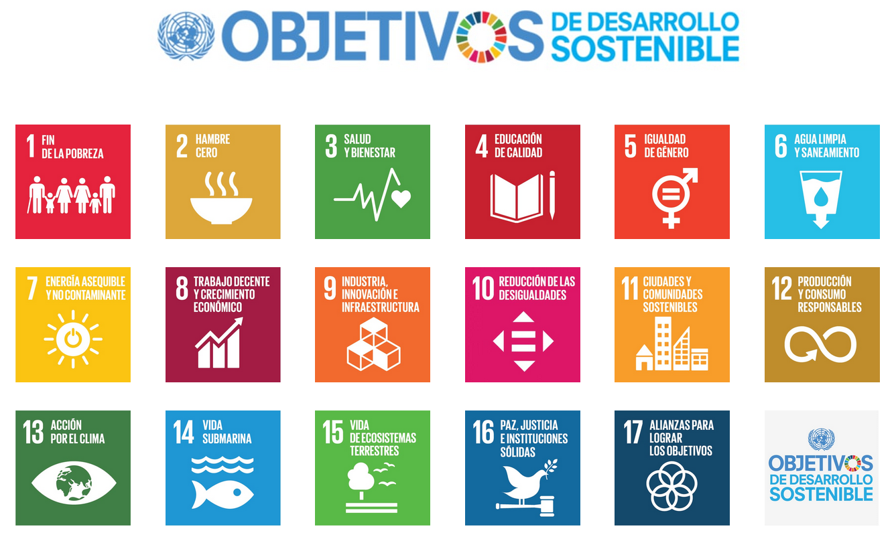

Introducción
=================

Esta documentación es el resultado de un proceso de reflexión personal, de búsqueda y 
análisis para proponer un prototipo de un nuevo programa educativo disruptivo e innovador. 
El programa propuesto pretende convertirse en un modelo para la construcción de nuevos programas 
de naturaleza similar.

El programa propuesto apunta al objetivo de desarrollo sostenible número 4 de las Naciones Unidas.

   Objetivos de desarrollo sostenible

   Figura tomada de :cite:p:`2022:UN`

|

La naturaleza del programa es interdisciplinaria y se espera que a futuro puedan formularse 
otros programas que con la misma vocación aborden otros objetivos de desarrollo sostenible.

El documento está estructurado en tres secciones. En la primer sección se presentarán iniciativas 
de innovación educativa alrededor del mundo que han servido de inspiración para elaborar esta propuesta. En 
la segunda sección se aborda el prototipo concreto como tal. Finalmente, en la tercera sección se 
dejará un base de datos de todos los recursos que se revisaron para darle forma a esta propuesta.

