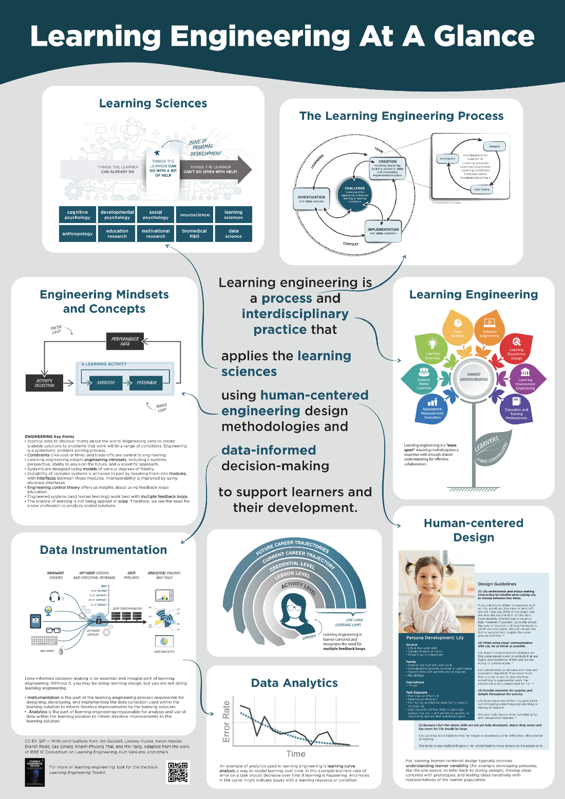
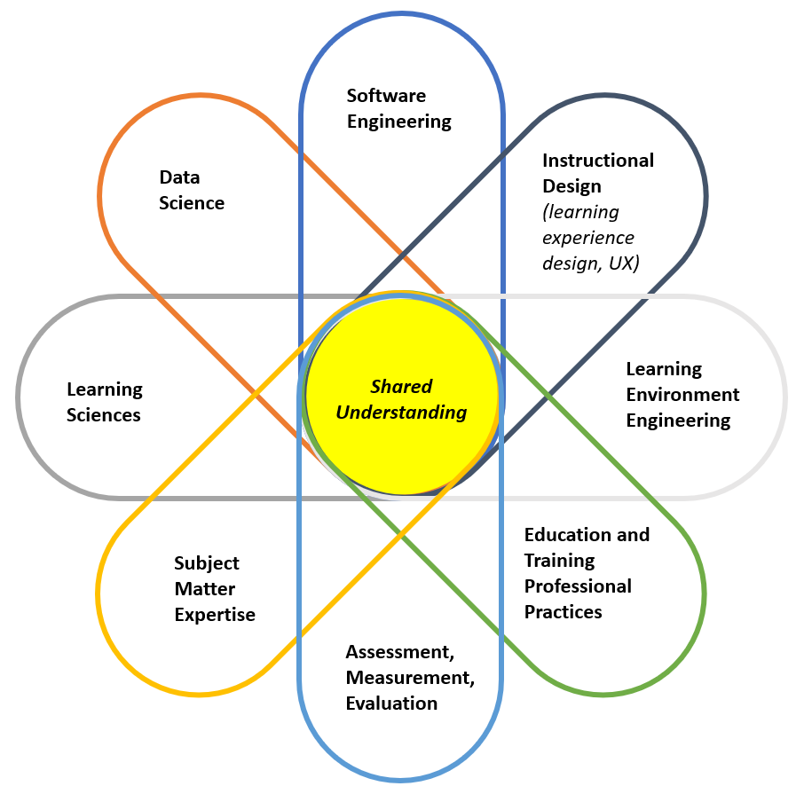

Prototipo de un programa disruptivo e innovador
=============================================================

Motivación 
---------------

El programa que se presenta a continuación busca FORMAR nuevos profesionales que tengan las competencias interdisciplinarias 
que permitan REPENSAR y CREAR la capacidad institucional para formular nuevos programas interdisciplinarios y 
para acompañar los procesos de formación, los cuales desde mi opinión requieren un nuevo tipo de profesor, un 
teamcher, un mentor, un líder. Profesores con habilidades para abordar las capacidades diversas y apoyar los procesos 
desarrollo personal de los estudiantes. A mi modo de ver, este tipo de profesores aún no existen.

En mayo del 2020 el vicerrector académico `señaló <https://www.youtube.com/watch?v=0BFDVVuu7Ow>`__ que:

  TENEMOS una brecha enorme y es PODER llevar TODO el modelo pedagógico de capacidades y competencias a los procesos 
  pedagógicos de curso;sin embargo, todavía no ha sido posible

  --Vicerrector Académico.

Mi hipótesis es que nos cuesta profundamente hacer algunas renuncias a formas tradicionales de hacer las cosas y 
además no contamos con una masa crítica de personas con una mentalidad y unas competencias interdisciplinarias que 
inspiren y empujen con fuerza estrategias de cambio radicales. La implementación misma del modelo pedagógico es un 
PROBLEMA muy COMPLEJO que requiere ser abordado desde un óptima interdisciplinaria. 

Denominación del programa
---------------------------

De este punto en adelante, el nuevo programa propuesto será denominado como ``Ingeniería del Aprendizaje`` o ``Learning`` 
``Engineering``. Claramente esta denominación tendrá que discutirse profundamente; sin embargo, será acogida en este 
documento porque es la denominación utilizada por el Consorcio Industrial en ``Ingeniería del Aprendizaje`` de la IEEE 
IEEE ICICLE por sus siglas en inglés. En principio, todo el fundamento teórico del programa usará los documentos 
publicados y en discusión de la IEEE ICICLE. Será una tarea posterior de la institución definir que tan alineado estará 
el programa a las definiciones de IEEE ICICLE.

Descripción del programa
------------------------

¿Qué es Ingeniería del Aprendizaje? 

Según `ICICLE <https://sagroups.ieee.org/icicle/>`__:

  Learning Engineering is a process and practice that applies the learning sciences using human-centered engineering design methodologies and data-informed 
  decision making to support learners and their development.

  --IEEE ICICLE

  La Ingeniería del aprendizaje es un PROCESO y una PRÁCTICA que aplica las ciencias del aprendizaje 
  usando métodos de diseño de ingeniería centrados en el humano y toma de decisiones basadas en datos 
  para soportar a los aprendices y a sus procesos de desarrollo.

En agosto de 2022 encontré `aquí <https://openlearning.mit.edu/news/learning-engineering-glance-poster-awarded-best-design-ifest-2022>`__ 
una ligera variación a la definición anterior. La dejaré en el documento porque me parece 
que aclara el alcance de la palabra PRÁCTICA en la definición. Adicionalmente, las personas que publican 
esta variación son reconocidos líderes de IEEE ICICLE. 

  Learning Engineering is a process and ``interdisciplinary practice`` that applies the learning sciences using human-centered 
  engineering design methodologies and data-informed decision-making to support learners and their development.

  --The “Learning Engineering at a Glance” poster co-authored by Aaron Kessler, assistant director of learning sciences 
    & teaching at MIT Open Learning, Jim Goodell, and Sae Schatz won the “People’s Choice Award for Best Poster Design” 
    at the Advanced Distributed Learning Initiative iFest 2022. This poster is adapted from the work of IEEE IC 
    Consortium on Learning Engineering, Kurt VanLehn, and others.

El poster original se observa en la siguiente figura y está tomado de 
`esta <https://medium.com/open-learning/learning-engineering-at-a-glance-poster-awarded-best-design-at-ifest-2022-1cfdfaf7dda3>`__ 
publicación en Medium realizada por MIT Open Learning. 

|

Descripción del perfil del egresado 
-------------------------------------

El perfil del egresado de Ingeniería del Aprendizaje es un perfil interdisciplinario. 
Según `IEEE ICICLE <https://sagroups.ieee.org/icicle/learning-engineering-process/>`__ la flor de conocimiento 
central de la Ingeniería del Aprendizaje se puede observar en la siguiente imagen:

Según :cite:t:`2022:godell` los roles típicos de un Ingeniero del aprendizaje son:

* Trabajar como consultor haciendo equipo con un instructor.
* Trabajar como miembro de un equipo diseñando experiencias de aprendizaje, plataformas, 
  recursos u otras soluciones como colaborador o como Ingeniero del Aprendizaje líder que coordina 
  varios especialistas y fija la dirección del trabajo a realizarse.
* Trabajando con varios Ingenieros del aprendizaje con una base de competencias y vocabulario compartido común 
  para practicar actividades de Ingeniería del Aprendizaje desempeñando diferentes roles y en diferentes áreas de 
  especialización.

Problemas abordados por el programa
-------------------------------------

Acercamiento al mapa de capacidades y competencias 
----------------------------------------------------

Propuesta de implementación
-----------------------------

