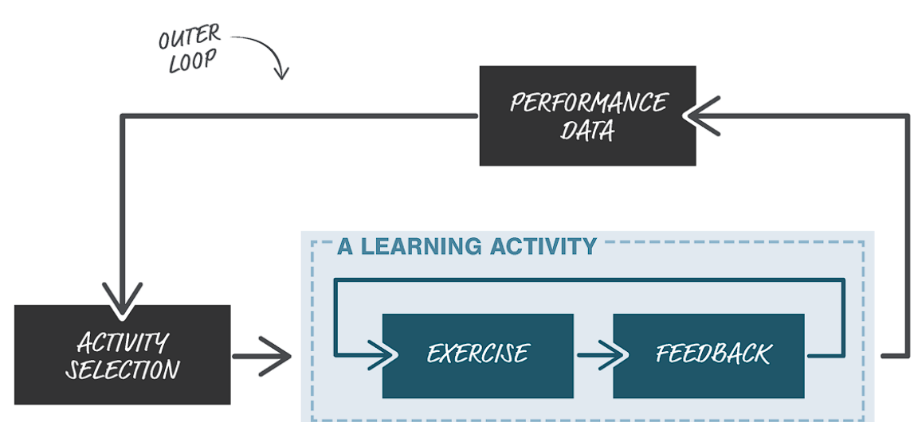

Prototipo de un programa disruptivo e innovador
=============================================================

Motivación 
---------------

El programa que se presenta a continuación busca FORMAR nuevos profesionales que tengan las competencias interdisciplinarias 
que permitan REPENSAR y CREAR la capacidad institucional para formular nuevos programas interdisciplinarios y 
para acompañar los procesos de formación, los cuales desde mi opinión requieren un nuevo tipo de profesor, un 
teamcher, un mentor, un líder. Profesores con habilidades para abordar las capacidades diversas y apoyar los procesos 
desarrollo personal de los estudiantes. A mi modo de ver, este tipo de profesores aún no existen.

En mayo del 2020 el vicerrector académico `señaló <https://www.youtube.com/watch?v=0BFDVVuu7Ow>`__ (:cite:t:`2020:upb`) que:

  TENEMOS una brecha enorme y es PODER llevar TODO el modelo pedagógico de capacidades y competencias a los procesos 
  pedagógicos de curso;sin embargo, todavía no ha sido posible

  --Vicerrector Académico.

Mi hipótesis es que nos cuesta profundamente hacer algunas renuncias a formas tradicionales de hacer las cosas y 
además no contamos con una masa crítica de personas con una mentalidad y unas competencias interdisciplinarias que 
inspiren y empujen con fuerza estrategias de cambio radicales. La implementación misma del modelo pedagógico es un 
PROBLEMA muy COMPLEJO que requiere ser abordado desde un óptica interdisciplinaria. 

Denominación del programa
---------------------------

De este punto en adelante el nuevo programa propuesto será denominado como ``ingeniería del aprendizaje`` o ``Learning`` 
``Engineering``. Claramente esta denominación tendrá que discutirse profundamente; sin embargo, será acogida en este 
documento porque es la denominación utilizada por el Consorcio Industrial en ``ingeniería del aprendizaje`` de la IEEE 
IEEE ICICLE por sus siglas en inglés. En principio, todo el fundamento teórico del programa usará los documentos 
publicados y en discusión de la IEEE ICICLE. Será una tarea posterior de la institución definir que tan alineado estará 
el programa a las definiciones de IEEE ICICLE.

Descripción del programa
------------------------

¿Qué es ingeniería del aprendizaje? 

Según `ICICLE <https://sagroups.ieee.org/icicle/>`__ (:cite:t:`2022:ieee-icicle`):

  Learning Engineering is a process and practice that applies the learning sciences using human-centered engineering design methodologies and data-informed 
  decision making to support learners and their development.

  --IEEE ICICLE

  La ingeniería del aprendizaje es un PROCESO y una PRÁCTICA que aplica las ciencias del aprendizaje 
  usando métodos de diseño de ingeniería centrados en el humano y toma de decisiones basadas en datos 
  para soportar a los aprendices y a sus procesos de desarrollo.

En agosto de 2022 encontré 
`aquí <https://openlearning.mit.edu/news/learning-engineering-glance-poster-awarded-best-design-ifest-2022>`__ (:cite:t:`2022:MIT`)
una ligera variación a la definición anterior. La dejaré en el documento porque me parece 
que aclara el alcance de la palabra PRÁCTICA en la definición. Adicionalmente, las personas que publican 
esta variación son reconocidos líderes de IEEE ICICLE. 

  Learning Engineering is a process and ``interdisciplinary practice`` that applies the learning sciences using human-centered 
  engineering design methodologies and data-informed decision-making to support learners and their development.

  --Tomado de The “Learning Engineering at a Glance” poster en coautoría por Aaron Kessler,Jim Goodell y 
  Sae Schatz. En the Advanced Distributed Learning Initiative iFest 2022.

El poster original se observa en la siguiente figura y está tomado de 
`esta <https://medium.com/open-learning/learning-engineering-at-a-glance-poster-awarded-best-design-at-ifest-2022-1cfdfaf7dda3>`__ (:cite:t:`2022:MIT-medium`) 
publicación en Medium realizada por MIT Open Learning. 

.. figure:: ../_static/posterLE.png
   :alt: Poster Learning Engineering at a Glance
   :class: with-shadow
   :align: center
   :width: 100%
   
   Tomado de :cite:t:`2022:MIT-medium`.

La ingeniería del aprendizaje se plantea como una ingeniería y no como un diseño porque aunque usa las metodologías del diseño,  
las combina con procesos guiados por DATOS y principios de ingeniería, tales como la teoría del control, que no son prácticas 
tradicionales del diseño. Esta combinación hace que la ingeniería del aprendizaje se acerque a una solución de mejor ajuste 
mediante la iteración. La ingeniería del aprendizaje puede confundirse con el diseño porque es CENTRADA EN EL USUARIO; sin embargo, 
esta es una idea fundamental porque para proponer una solución la ingeniería del aprendizaje debe entender profundamente a 
las personas que la usarán o se beneficiarán de ella.

La ingeniería del aprendizaje NO solo se trata de producir productos tecnológicos o plataformas educativas. Una solución de 
la ingeniería del aprendizaje puede ser un recurso educativo simple, la mejora a un proceso, la mejora de un espacio físico 
o en general cualquier solución que soporte los procesos de aprendizaje y desarrollo del aprendiz, es decir, cualquier cosa 
que permita solucionar un problema del aprendizaje. 

Descripción del perfil del egresado 
-------------------------------------

El perfil del egresado de ingeniería del aprendizaje es un perfil interdisciplinario. 
Según `IEEE ICICLE <https://sagroups.ieee.org/icicle/learning-engineering-process/>`__ (cite:t:`2022:ieee-icicle-process`) la flor de conocimiento 
central de la ingeniería del aprendizaje se puede observar en la siguiente imagen:

   Tomado de :cite:t:`2022:MIT-medium`.

Esta flor de conocimiento implica que el Ingeniero del aprendizaje podría desempeñarse en ámbitos 
específicos o pétalos de la flor, compartiendo vocabulario con profesionales disciplinares y/o otros 
Ingenieros del aprendizaje enfocados en otros pétalos.

Según :cite:t:`2022:godell` los roles típicos de un Ingeniero del aprendizaje son:

* Trabajar como consultor haciendo equipo con un instructor.
* Trabajar como miembro de un equipo diseñando experiencias de aprendizaje, plataformas, 
  recursos u otras soluciones como colaborador o como Ingeniero del aprendizaje líder que coordina 
  varios especialistas y fija la dirección del trabajo a realizarse.
* Trabajando con varios Ingenieros del aprendizaje con una base de competencias y vocabulario compartido común 
  para practicar actividades de ingeniería del aprendizaje desempeñando diferentes roles y en diferentes áreas de 
  especialización.

Problemas abordados por el programa
-------------------------------------

Aprender es un proceso que ocurre en casi todos los ámbitos de la vida tales como la familia, los colegios, las universidades, 
las empresas, entre otros. Cada uno de estos ámbitos produce problemas que dificultan el proceso de desarrollo y aprendizaje 
del aprendiz. Según :cite:t:`2022:godell` un Ingeniero del aprendizaje participa en equipos interdisciplinarios que abordan los problemas
relacionados con:

* Crear las condiciones para un aprendizaje óptimo.
* Optimizar experiencia de aprendizaje.
* Construir productos educativos que puedan emplearse como SOLUCIONES ESCALABLES.
* Diseñar experiencias de aprendizaje.
* Afronta las condiciones ambientales o externas, es decir, las condiciones que conducen a un aprendizaje óptimo. Por 
  ejemplo la arquitectura de un ambiente físico o virtual de aprendizaje, las estructuras sociales, la mentalidad de los aprendices, 
  hábitos y prácticas de los aprendices.
* Diseño curricular.
* Desarrollo de tecnologías educativas.
* Analítica del aprendizaje.
* aprendizaje personalizado.
* Instrumentar experiencias de aprendizaje para alimentar el proceso iterativo de creación, implementación e investigación de las soluciones.
* Instrumentar experiencias de aprendizaje para optimizar las actividades de aprendizaje y retroalimentación.

Críticas 
-----------

En este artículo (:cite:t:`2019:Chandler`) del primero congreso de Learning Engineering, una de las autoras,  
Chelsea Chandler de la Universidad de Michigan, cuenta de manera anecdótica su primera impresión al escuchar en 
la misma frase las palabras ingeniería y aprendizaje. Me pasó lo mismo. Y aunque no estoy formado en una escuela 
de ciencias humanas, si estoy familiarizado con las formas de la ingeniería. ingeniería y aprendizaje en la misma 
frase traen a la mente ideas como la escuela al servicio de la industria, la eficiencia social, expertos que 
realizan procesos de ingeniería que maximizan el material a enseñar a la mayor cantidad de estudiantes, en el menor 
tiempo posible. En :cite:t:`2022:godell` también se apunta a la percepción de muchas personas que ven la palabra 
ingeniería como algo mecánico o industrial. En :cite:t:`2019:Chandler` aclaran que la idea de la ingeniería 
del aprendizaje no es sacar del proceso a los profesores, más bien plantea a un profesor como un Ingeniero que 
diseña, construye e implementa soluciones a problemas complejos situados en ambientes con variables dinámicas. 
:cite:t:`2022:godell` dicen que los Ingenieros del aprendizaje no diseñan el aprendizaje más de lo que los 
ingenieros civiles diseñan a los civiles. Un Ingeniero civil crea y mantiene la infraestructura física para 
el beneficio de los civiles. Un Ingeniero del aprendizaje crea soluciones para el beneficio de los aprendices.

Más allá de las discusiones al respecto me parece que lo importante es no perder de vista que el Ingeniero 
del aprendizaje no diseña el aprendizaje. El aprendizaje es un proceso HUMANO que ocurre en el cerebro de cada persona. 
Más bien, como lo apunta la definición el Ingeniero del aprendizaje SOPORTA el aprendizaje de una persona y 
su desarrollo.

Según :cite:t:`2022:Lee`, en relación a la ciencias del aprendizaje, es escéptico ante la noción de 
la ingeniería del aprendizaje como una nueva disciplina o como ciencias del aprendizaje aplicadas. En ese sentido concuerdo 
con lo que señala :cite:t:`2022:godell`, la ingeniería del aprendizaje parte de ideas informadas de las ciencias 
del aprendizaje y desde ahí refina sus soluciones de manera iterativa usando DATOS y analítica para la toma de decisiones 
acerca de la dirección y la próxima iteración de la solución en construcción. Concuerdo también con lo que plantea 
:cite:t:`2022:godell` como los objetivos de la ciencia y la ingeniería. El objetivo de la ciencia es descubrir la verdad 
acerca del mundo tal como es. El objetivo de la ingeniería es crear SOLUCIONES ESCALABLES a problemas mediante 
el uso de la ciencia como una HERRAMIENTA.

:cite:t:`2019:Watters` plantea una cuestión muy interesante. Los profesionales como los diseñadores instruccionales o 
los tecnólogos instruccionales cuyos títulos son en tecnologías educativas y similares cuestionan si la ingeniería 
del aprendizaje es simplemente un CAMBIO DE MARCA, una forma de renombrar sus profesiones por una con un campo 
de acción más amplio y lucrativo como lo es la ingeniería. Al respecto en :cite:t:`2019:godell` plantea la pregunta 
``Are You Doing Learning Engineering—Or Instructional Design?`` Concuerdo con la acercamiento del autor a esta 
cuestión y se trata de reflexionar en esta otra pregunta ¿El proyecto de diseño instruccional actual es un 
proyecto de ingeniería del aprendizaje? Basado en la definición de ingeniería del aprendizaje la respuesta a esta 
última pregunta sería AFIRMATIVA si:

* Se aplican las ciencias del aprendizaje ``Y``
* Se usan metodologías de diseño de ingeniería centradas en el humano ``Y``
* Se toman decisiones basadas en DATOS.

Acercamiento a las competencias del programa  
----------------------------------------------

En esta parte del documento no se propondrán las competencias del programa, esta tarea se dejará para una fase 
posterior en la cual un grupo de personas de la institución las construya siguiendo un proceso de análisis 
interdisciplinario; sin embargo, se propondrá un marco desde el cual se pretende dejar 
un punto de partida para el análisis propuesto como fase posterior.

Para acercarse a una posible propuesta de competencias para el ingeniería del aprendizaje 
es importante recordar algunas definición:

* ingeniería del aprendizaje. "Learning Engineering is a process and ``interdisciplinary practice`` that applies the learning sciences using human-centered 
  engineering design methodologies and data-informed decision-making to support learners and their development."
* Competencia. Actuación integral para IDENTIFICAR, INTERPRETAR, ARGUMENTAR y RESOLVER PROBLEMAS del contexto integrando 
  conceptos y teorías, actitudes y valores, y habilidades procedimentales y técnicas.

De estas definiciones se proponen estas consideraciones:

* Una competencia se entenderá como una unidad compuesta de tres partes: conceptos y teorías, actitudes y valores, y 
  habilidades procedimentales y técnicas. Por tanto, un aprendiz puede conocer un concepto, pero si no lo aplica correctamente 
  mediante algún procedimiento y actitud para resolver un problema entonces diremos que no es competente aún. Dicho de otra 
  manera, el aprendiz exhibirá una competencia cuando sea posible observar de manera integrada el despliegue de los 
  tres elementos en una situación PROBLEMÁTICA.
* Para encontrar las competencias de ingeniería del aprendizaje se partirá de la definición y se deberán identificar competencias 
  necesarias para: seguir el proceso, practicar desde varias disciplinas, aplicar las ciencias del aprendizaje, usar metodologías de diseño de ingeniería centradas en 
  el humano, instrumentar el proceso y la experiencia de aprendizaje, analizar el proceso y la experiencia usando datos 
  para la toma de decisiones y actuar con ética.
* Para poder observar y de esa manera evaluar las competencias se deben proponer PROBLEMAS de contexto. De esta manera la 
  evaluación es CENTRADA en resolver problemas más que en determinar el grado de apropiación de los contenidos.

Acercamiento a las competencias para el PROCESO de ingeniería del aprendizaje
*******************************************************************************

Según :cite:t:`2022:godell` el proceso de la ingeniería del aprendizaje inicia con un RETO. El reto consiste en ENTENDER 
la oportunidad para mejorar el aprendizaje o las condiciones para que este se de en un CONTEXTO. El contexto es todo 
aquello que rodea al reto. Incluye a las personas (el aprendiz, el equipo de ingeniería del aprendizaje, profesores, tutores, 
administrativos), el ambiente físico o virtual, los antecedentes y el conocimiento previo del aprendiz, las normas 
culturales del aprendiz (hogar, comunidad y comunidad de aprendizaje), todo sobre el grupo poblacional del aprendiz y las 
posible condiciones de aprendizaje que puedan ayudar o dificultar el aprendizaje. El contexto incluirá 
las normas, las expectativas, las prestaciones y las limitaciones que tendrán que ser tenidas en cuenta para afrontar 
el reto.Luego de esto el proceso incluye ciclos de CREACIÓN, IMPLEMENTACIÓN e INVESTIGACIÓN que se desarrollan de manera 
iterativa y no necesariamente en orden. Incluso los ciclos pueden ser paralelos. El proceso es iterativo y lo 
que se hace en cada iteración depende de los datos extraídos y analizados de la iteración anterior.

.. figure:: ../_static/LEprocess.png
   :alt: El proceso de la ingeniería del aprendizaje
   :align: center
   :width: 100%

   Tomado de :cite:t:`2022:MIT-medium`.

En el proceso de la ingeniería del aprendizaje ENTENDER el reto es central. Este entendimiento incluye entender 
los objetivos del aprendizaje, a los aprendices y las condiciones que dificultan o ayudan al aprendiz a lograr los 
objetivos. Como en cualquier otra actividad de diseño o ingeniería la clave del proceso es ENTENDER profundamente el 
reto antes de buscar cualquier solución. Es por esta razón que el proceso de la ingeniería del aprendizaje es iterativo 
y es porque con cada iteración se comprende mejor el reto y de esta manera la solución es más ajustada al objetivo.  

Acercamiento a las competencias desde la práctica INTERDISCIPLINARIA
*******************************************************************************

Para resolver un problema de la ingeniería del aprendizaje :cite:t:`2022:godell` propone la necesidad 
de un abordaje interdisciplinario. La comunidad de IEEE ICICLE ha definido una flor cuyos 
pétalos representan los campos disciplinares o profesionales que pueden llegar a ser parte de una solución 
de ingeniería del aprendizaje:

   Tomado de :cite:t:`2022:MIT-medium`.

Es importante anotar que la formación de un Ingeniero del aprendizaje no debería caer en el error 
de abordar de manera aislada cada disciplina, es decir, se debería descartar de entrada la idea 
de construir un plan de estudios donde cada pétalo sea un área de estudio separada. Dada la naturaleza interdisciplinaria 
del programa sería más coherente abordar los pétalos de manera integrada. Para lograrlo se sugiere estructurar 
el plan de estudio no por cursos, si no por PROBLEMAS. Las necesidades de cada problema irán mostrando 
qué disciplinas en términos de conceptos, procesos y actitudes tendrán que consultarse para abordar el 
problema. Considero que el enfoque formativo debería estar orientado a la formación en competencias que permitan 
establecer puentes de comunicación entre las disciplinas mediante un lenguaje común y para indagar y tomar de estas 
lo que se requiere para aplicarlo a la solución del problema. 

Acercamiento a las competencias desde las ciencias del aprendizaje
********************************************************************

Las ciencias del aprendizaje proveen la perspectiva de cómo funciona el cerebro y cómo aprenden las personas. El trabajo 
de la ingeniería del aprendizaje es APLICAR esta información para construir ``SOLUCIONES ESCALABLES``. 

   Tomado de :cite:t:`2022:MIT-medium`.

.. note:: EL RETO

    Las soluciones que desarrolla la ingeniería del aprendizaje NO SON soluciones para la media. Las soluciones 
    se adaptan y personalizan la experiencia de aprendizaje para optimizar los resultados de aprendizaje individuales.

Para lograr un aprendizaje productivo se requiere que las actividades de aprendizaje sean continuas y con el nivel justo 
de dificultad. Si las tareas propuestas son muy difíciles serán frustrantes y no se conectarán con el conocimiento previo. 
Si las tareas son muy fáciles y no ofrecen un reto serán aburridas. En la mitad de estos extremos está lo que las ciencias 
cognitivas llaman las ``dificultades deseables`` (:cite:t:`2011:bjorkmaking`). El reto de la ingeniería del aprendizaje es 
proponer soluciones escalables y personalizadas que mantengan a los aprendices en sus ``zonas de desarrollo proximal``. 
En otras palabras, para personalizar una experiencia de aprendizaje es necesario entregar las dificultades 
deseables en la medida justa para provocar esfuerzo sin frustración.

Las ciencias del aprendizaje son la base de la ingeniería del aprendizaje; sin embargo, se deben entender como el punto 
de partida de una solución, es decir, como la primera iteración que permite que la solución converja más rápidamente o en menos 
iteraciones. Según :cite:t:`2022:godell` los esfuerzos para diseñar una solución de aprendizaje efectiva no deben basarse 
únicamente en teorías del aprendizaje validadas porque los avances teóricos suelen ser demasiado lentos y definidos en 
condiciones ideales. La ingeniería del aprendizaje usa métodos iterativos de diseño, implementación, evaluación y re-diseño 
permitiendo encontrar soluciones de manera más ágil.

Acercamiento a las competencias desde los métodos de diseño de ingeniería centrados en el humano
***************************************************************************************************

Según :cite:t:`2015:ideo` el diseño centrado en el humano requiere al menos la realización de las siguientes 
seis actividades:

#. Observación para entender a los usuarios objetivo y su entorno.
#. Ideación para generar opciones para abordar los retos.
#. Prototipado rápido para materializar las decisiones de diseño y poder recibir retroalimentación rápida 
   de los usuarios.
#. Pruebas de usuario en torno a prototipos para recopilar preferencia y datos de usabilidad de los usuarios finales.
#. Re-diseño de las ideas y los prototipos usando los datos de la actividad anterior.
#. Iteración para ir refinando el prototipo hasta la solución final.

Uno de los grandes desafíos de la ingeniería del aprendizaje es el diseño para la variabilidad porque todas 
las personas aprenden a diferentes ritmos y parten de modelos mentales distintos. La ingeniería del aprendizaje 
toma entonces métodos y prácticas del design thinking, el diseño participativo y el diseño justo para afrontar 
dicha variabilidad.

Además de estar centrada en el humano o el usuario, la ingeniería del aprendizaje debe enfocarse en el aprendizaje, 
es decir, aprendices que aprenden más que en usuarios que usan un diseño. Según :cite:t:`1994:Soloway` las interacciones 
informáticas más utilizables no siempre son las mejores formas de aprender los conceptos y las 
habilidades específicas. Por tanto, un diseño centrado en el aprendizaje debe incluir tanto la usabilidad como 
los resultados de aprendizaje. Es así como además de los acercamientos que se usan para afrontar el diseño para la 
variabilidad, es necesario usar métodos y prácticas para abordar el aprendizaje como el diseño universal para 
el aprendizaje (universal design for learning), el diseño de experiencias de aprendizaje (learning experience design o 
LxD) y la investigación basada en el diseño (design-based design). 

Acercamiento a las competencias desde la ingeniería
*****************************************************

Para la ingeniería del aprendizaje las ciencias del aprendizaje no son un fin en si, son más bien una 
herramienta para resolver problemas. Esto plantea las siguientes preguntas: ¿Qué ciencia básica debe estudiar 
un ingeniero del aprendizaje? ¿Cuándo deben estudiarse esas ciencias básicas? Sin el ánimo de adentrarse en 
esa discusión en este punto dejo mi opinión al respecto. Considerando que la práctica de la ingeniería del 
aprendizaje es interdisciplinaria y que las ciencias básicas son una herramienta para resolver problemas se 
sugiere que el estudio de las mismas se haga justo a necesidad del problema a resolver. Se nos dice 
constantemente que un ingeniero debe saber matemática y física, pero en mi opinión lo importante de la ciencia 
básica no es saberla como un requisito más para obtener el título de ingeniero, sino más bien aplicarla como 
una herramienta que permita abordar problemas cada vez más complejos. En ese sentido considero que la ciencia 
básica debería ir de menos a más en la formación del ingeniero del aprendizaje, es decir, problemas más complejos 
demandarán ciencia básica más compleja. Es por ello que un plan de estudios centrado en problemas y no en cursos 
deberá seleccionar cuidadosamente las experiencias de aprendizaje necesarias que le permitan al ingeniero del 
aprendizaje ver en las ciencias básicas un aliado y no un obstáculo.

La ingeniería del aprendizaje como toda ingeniería debe aborda compromisos (trade-offs) y debe navegar las 
restricciones para alcanzar resultados prácticos. La ingeniería del aprendizaje debe ir más allá de la ciencia haciendo 
sus propios experimentos y realizando sus propios compromisos porque un ingeniero del aprendizaje busca solucionar 
problemas pero siempre tendrá que realizar compromisos para alcanzar el nivel de optimización deseado.

Según :cite:t:`2022:godell` además de la matemática la ingeniería del aprendizaje requiere de otras ciencias 
para resolver problemas como por ejemplo las ciencias cognitivas, las socioculturales, las comportamentales 
y las motivacionales. 

En la ingeniería del aprendizaje se busca construir soluciones escalables y personalizadas. Por tanto, se 
aplica la teoría de control para el aprendizaje personalizado:

   Tomado de :cite:t:`2022:godell`.

Según :cite:t:`2022:godell` "el sistema de educación tradicional es un sistema de control de lazo abierto. Se establecen un conjunto de objetivos 
o recientemente resultados de aprendizaje. Esto se traslada a instrucciones en forma de libros de texto, clases magistrales 
y ejercicios. Estas actividades se entregan a los aprendices dando como resultado las habilidades o competencias esperadas. 
En el sistema tradicional a todos los aprendices se les entregan las mismas actividades. Los sistemas de lazo abierto 
requieren sistemas muy precisos y un gran margen de error aceptable. Los alumnos llegan a un curso con personalidad, 
talentos, preferencias y antecedentes diferentes. El resultado de aplicar un sistema de control en lazo abierto en estas 
circunstancias producirá como resultado un margen de error muy amplio. Los buenos profesores y diseños curriculares proveen 
retroalimentación constante a los aprendices y adaptan la enseñanza a las necesidades de estos. Los buenos aprendices a su vez 
adaptan su estrategia de aprendizaje en función de la retroalimentación." Ambas estrategias de adaptación requieren el uso de 
rúbricas que permitan comparar la retroalimentación con un estándar de lo que se espera. Lo anterior es precisamente la 
manera como funciona un sistema de control de lazo cerrado tal como lo muestra la figura anterior. Lo ideal es que esta 
estrategia se pueda aplicar con cada aprendiz, pero la realidad es que que el costo de implementar esta idea con cada uno 
es prohibitivo. El reto entonces de la ingeniería del aprendizaje es lograr lo anterior a escala y con costos razonables.

Idealmente un sistema instruccional adaptativo necesitaría múltiples lazos de retroalmentación:

   Tomado de :cite:t:`2022:MIT-medium`.

Por ejemplo, las dos capas más internas se verían así:

   Tomado de :cite:t:`2022:MIT-medium`.

En la figura se observa un primer lazo de control cerrado al realizar una actividad y luego otro lazo cerrado 
más externo para seleccionar la siguiente actividad de la lección.

:cite:t:`2022:godell` explica que en control una ``función de transferencia`` permite describir matemáticamente 
la relación entre las entradas y las salidas de un sistema. Esta información es usada por el controlador para 
poder anticipar qué entrada será necesaria para lograr una salida específica. En la ingeniería del aprendizaje 
según :cite:t:`2022:godell` la función de transferencia es una ``teoría del aprendizaje``. Esta teoría permite 
seleccionar la actividad que le permitirá al estudiante aprender. Debido a la variabilidad de las personas cada 
una tendrá su PROPIA FUNCIÓN DE TRANSFERENCIA que además será variable en el tiempo. Es por ellos que los sistemas 
que proponga la ingeniería del aprendizaje tendrán que actualizar esa función de transferencia por aprendiz y 
adaptarse en el tiempo a esa variabilidad. 

En :cite:t:`2022:godell` se discuten otros asuntos importantes que deberían consultarse posteriormente como son 
la velocidad de la retroalimentación para minimizar los tiempos de propagación y la frecuencia y la riqueza de la 
retroalimentación. Según :cite:t:`2022:godell` la teoría del control dice que una retroalimentación rápida y frecuente 
permite compensar las medidas imprecisas y las funciones de transferencia pobres. En términos educativos, permitiría 
compensar una evaluación subóptima y una teoría del aprendizaje menos que perfecta. Sin embargo, mucha retroalimentación 
puede ser poco productiva para el aprendiz porque genera alta carga cognitiva y afecta el nivel de dificultad deseado.

En :cite:t:`2022:MIT-medium` se resumen los puntos claves de la ingeniería en la ingeniería del aprendizaje:

* La ciencia tiene como objetivo descubrir verdades sobre el mundo. La ingeniería busca crear soluciones escalables 
  a problemas que funcionen dentro de un rango de condiciones. La ingeniería es un proceso sistemática para 
  solucionar problemas.
* Las restricciones y los compromisos son centrales a la ingeniería.
* La ingeniería del aprendizaje adopta la mentalidad de la ingeniería, incluyendo el pensamiento sistémico, la capacidad 
  de imaginar el futuro y el enfoque científico.
* Los sistemas se diseñan usando modelos de varios grados de fidelidad.
* La escalabilidad de los sistemas complejos se aborda mediante estrategias modulares, es decir, partir el sistema 
  en módulos con interfaces estándares entre ellos para favorecer la interoperabilidad.
* La teoría del control ofrece ideas acerca del uso de ciclos de retroalimentación aplicados al aprendizaje. El aprendizaje 
  humano funciona mejor con múltiples lazos de retroalimentación.
* Las ciencias del aprendizaje no se están aplicando a escala. Por tanto, la ingeniería del aprendizaje se presenta 
  como una nueva profesión que ayude a producir soluciones de aprendizaje a escala.

Acercamiento a las competencias desde la captura de datos y la analítica 
*************************************************************************

El proceso de ingeniería del aprendizaje es altamente dependiente de los datos. Los datos se usan para tomar 
decisiones en el proceso relativas a la experiencia y al proceso mismo. Ambas cosas se ajustan iterativamente 
gracias al uso de los datos. 

.. warning:: MUY IMPORTANTE 

  Si en un proceso de diseño e implementación de una experiencia de aprendizaje no se recolectan  
  datos y no se analizan entonces no se está haciendo ingeniería del aprendizaje.

Según :cite:t:`2022:godell` para tomar decisiones basadas en datos, la ingeniería del aprendizaje necesita hacer dos cosas:

* Instrumentación. Es la parte de la ingeniería del aprendizaje encargada del diseño, desarrollo e implementación 
  de la recolección de datos en una solución de aprendizaje indispensable para realizar mejoras a esta en 
  cada iteración.
* Analítica. Es la parte de la ingeniería del aprendizaje responsable del análisis de los datos recolectados en la 
  instrumentación para realizar mejoras iterativas a la solución de aprendizaje.

En :cite:t:`2022:MIT-medium` se resume el papel de los datos en el proceso de la ingeniería del aprendizaje:

   Tomado de :cite:t:`2022:MIT-medium`.

   Tomado de :cite:t:`2022:MIT-medium`.

Propuesta de implementación del programa ingeniería del aprendizaje
--------------------------------------------------------------------

La propuesta de implementación se entrega para el programa interdisciplinario ingeniería del aprendizaje; sin embargo, 
esta propuesta no se reduce solo al programa en cuestión sino que pretender mostrar cómo podrían implementarse 
una familia de programas de naturaleza interdisciplinarios.

Principios
*************

La propuesta está fundamentada en dos principios:

#. El respeto por la diferencia 
#. El mastery learning (:cite:t:`2022:wiki-mastery`)

El respeto por la diferencia. Todos tenemos ritmos y tiempos de aprendizaje diferentes. Todos nuestros estudiantes 
deberían tener la oportunidad de alcanzar el máximo nivel esperado. Las implicaciones son fundamentales en términos 
del potencial para cambiar la mentalidad de las estudiantes.

El mastery learning. Se propone un sistema de ``TIEMPO VARIABLE pero CALIDAD CONSTANTE``. Quiere decir, que el estudiante 
debe poder llegar a dominar el objetivo de aprendizaje aunque le tome más o menos tiempo hacerlo.

Características de la propuesta a la luz del modelo pedagógico institucional
******************************************************************************

La propuesta está en completa armonía con el modelo pedagógico institucional que busca privilegiar el aprendizaje, la 
posición activa del estudiante, el papel mediador del profesor, la relación profesor-estudiante basada en el diálogo 
y el respeto, el reconocimiento de la dignidad del otro como persona, la investigación sin descartar el método 
expositivo, el trabajo experimental, la práctica y las actividades independientes debidamente acompañadas. Lo anterior 
busca superar el modelo pedagógico tradicional centrado en la enseñanza, el papel receptor del estudiante y de 
transmisor del conocimiento asumido por el profesor.

Se propone:

* El aprendizaje personalizado que reconoce las condiciones cognitivas de cada estudiante.
* La posición de autonomía del estudiante, observada por el docente. La motivación es intrínseca.
* El docente y el estudiante proponen caminos, pero es el estudiante quien toma las decisiones.
* El diálogo es la esencia misma de los encuentros presenciales entre docentes y estudiantes.
* Se reconoce la dignidad del otro como la oportunidad de desarrollarse al 100%.
* La investigación como el proceso mismo. La formación del espíritu científico, en tanto se reconocen constantemente 
  los problemas, hipótesis, alternativas de solución y se hacen reportes de los avances y las dificultades.
* Se aborda la metacognición del proceso.
* El acompañamiento está determinado por la necesidades del estudiante e incluye las dimensiones de desarrollo 
  personal, profesional y académicas.

.. note:: LA GRAN PROPUESTA

   En este modelo de implementación el docente escucha al estudiante casi todo el tiempo versus el modelo 
   tradicional en el cual los estudiantes escuchan al docente casi todo el tiempo.

Evaluación
************

La evaluación está centrada en el mejoramiento continuo. Es lo que en el modelo pedagógico institucional se 
reconoce como evaluación formativa. Dicha evaluación es la más importante. La evaluación sumativa pasa a un 
segundo plano, es una consecuencia orgánica de centrar el modelo en una evaluación auténtica. La evaluación 
sirve para mejorar, para dominar el objetivo de aprendizaje definido.

La evaluación está centrada en resolver problemas más que en determinar el grado de apropiación del conocimiento. La 
evaluación se aborda mediante procesos y productos que demuestran la solución de problemas. Por tanto, evaluar 
en esta propuesta implica observar cómo se encaran (proceso) y resuelven dichos problemas.

Competencias, criterios y resultados de aprendizaje
*****************************************************

Para abordar los problemas se requieren unas competencias. Por definición institucional una competencia es 
una actuación integral para ``identificar``, ``interpretar``, ``argumentar`` y ``resolver problemas`` del contexto integrando 
``conceptos`` y teorías, ``actitudes`` y valores, y ``habilidades`` procedimentales y técnicas.

Las competencias se desagregan en criterios de competencia. Esto criterios deberán responder por los tres 
componentes de una competencia, es decir, se deberán definir criterios de competencia relacionados con los 
conceptos y teorías, con las actitudes y valores y con las habilidades procedimentales y técnicas. Esto se debe 
hacer por cada competencia definida.

Los resultados de aprendizaje están vinculados con el nivel al cual se desarrolla cada criterio de competencia. 
En la institución los niveles son receptivo, resolutivo, autónomo y estratégico.

En esta propuesta se propone el diseño de experiencias de aprendizaje que movilicen competencias, es decir, 
las experiencias de aprendizaje deben permitir que el estudiante despliegue la o las competencias a observar. 
Estas competencias serán las necesarias para poder abordar el problema. El reto del estudiante y el docente es 
poder observar en el proceso de solución del problema si un criterio de competencia está fallando. Es allí 
donde se interviene mediante ejercicios conjuntos de evaluación formativa con retroalimentación y metacognición.

Plan de estudios
*****************

El plan de estudios de ingeniería del aprendizaje es centrado en problemas, no en cursos. Por tanto, el plan 
de estudios no define cursos. El estudiante matricula problemas o situaciones problemáticas donde el problema 
no necesariamente está bien definido. La facultad ofertará los problemas que podrán 
ser propuestos por docentes, estudiantes, empresas, entes gubernamentales, entre otros. Los problemas que el estudiante 
matriculará irán aumentando en complejidad e incertidumbre. Se podría decir que el plan de estudios es basado 
en problemas; sin embargo, a medida que el estudiante avanza en el programa los problemas se irán convirtiendo 
en ``retos``.

Metodología del programa
**************************

Las experiencias de aprendizaje en el programa se diseñarán observando tres posibles estrategias. Aprendizaje 
basado en proyectos, aprendizaje basado en problemas y aprendizaje basado en retos. La diferencias entre estas 
tres aproximaciones se pueden consultar en `este <https://observatorio.tec.mx/edu-reads/aprendizaje-basado-en-retos/>`__ 
(:cite:t:`2015:tec`) documento del Tecnológico de Monterrey y más recientemente en 
`este <https://transferencia.tec.mx/english/outstanding/do-you-know-what-challenge-based-learning-is/>`__ (:cite:t:`2021:Membrillo`) 
artículo.

Como punto de partida se sugiere revisar la metodología de aprendizaje basado en retos propuesta por la Universidad 
ECIU en `este <https://youtu.be/CFCSvvsPWUA>`__ (:cite:t:`2021:UT`).