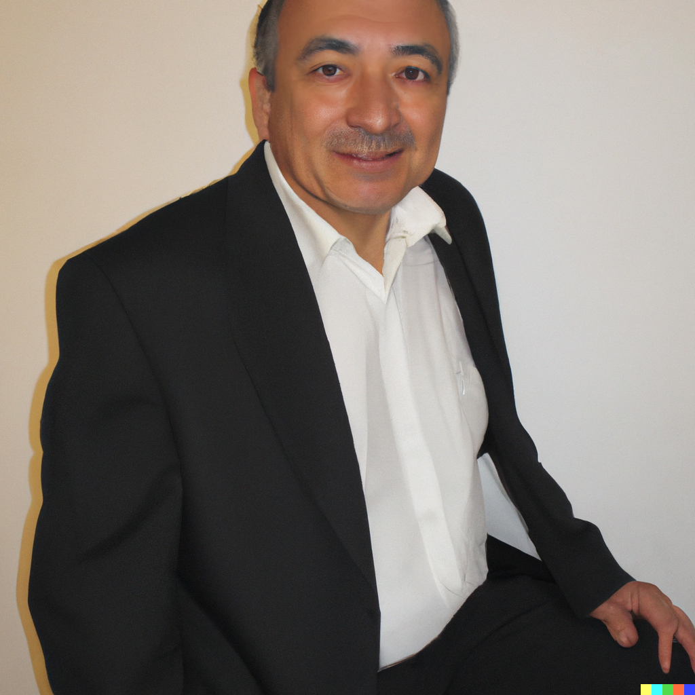

Trayectos 3C
==============================

Motivación 
---------------

La realización de la fase 1 de este documento termina con una presentación 
que justifica las decisiones de diseño tomadas para elaborar el programa 
Ingeniería del aprendizaje. En `este <https://docs.google.com/presentation/d/1wQutd7V4lPqbEpYd-pa28-A_3MGbomh3yAmrth9LqEg/edit?usp=sharing>`__ 
enlace se puede consultar la presentación que busca responder la pregunta ¿Por qué 
Ingeniería del aprendizaje? Una vez realiza la presentación se toma la decisión de 
construir una propuesta más general que no responda necesariamente a las lógicas 
impuestas por lo programas reguladores por el ministerio de educación de Colombia. 
De esta manera se da inicio a lo siguiente fase que corresponde al diseño 
de un producto nuevo para la Universidad que en principio no tendrá que estar 
regulador por el ministerio de educación. 

¿Cuál es el propósito de Trayectos 3C?
----------------------------------------

El propósito fundamental y general de los programas propuestos por Trayectos 3C 
es acompañar y apoyar a las personas en diversas etapas de sus vidas en un camino 
de exploración y autodescubrimiento para diseñar y vivir vidas significativas, 
auténticas y plenas. Estos programas, como parte de la aspiración más amplia de 
REDISEÑAR EL MUNDO para alcanzar un estado de bienestar colectivo con desarrollo 
sostenible, se centran en brindar una educación centrada en la VIDA. Buscan ofrecer 
orientación, recursos y oportunidades para que los participantes exploren sus 
intereses, descubran su pasión y, además, desarrollen las habilidades necesarias 
para materializar sus objetivos personales y profesionales. A través de enfoques 
personalizados y experiencias colectivas, los programas tienen como objetivo 
respaldar a las personas en la construcción de un camino único que esté alineado 
con sus valores y aspiraciones, mientras les proporcionan el apoyo necesario para 
adquirir las habilidades requeridas y lograr un mayor bienestar, impacto y 
satisfacción en sus vidas. Además, estos programas están diseñados para que los 
participantes puedan llevar a la ACCIÓN las visiones que están diseñando, 
contribuyendo así al rediseño colectivo de un mundo equitativo, sostenible y lleno 
de posibilidades.

.. note:: EL PROPÓSITO DE TRAYECTOS 3C

    En resumen, el propósito de los Trayectos 3C es contribuir al rediseño 
    colectivo de un mundo equitativo y sostenible mediante productos y servicios 
    que permitan acompañar y apoyar a personas en diversas etapas de la vida en 
    la exploración, diseño y materialización de vidas significativas.

¿Qué es Trayectos 3C?
----------------------

Trayectos 3C propone unas rutas de aprendizaje que permiten configurar de manera 
modular múltiples programas educativos. Está compuesto por 3 módulos que pueden 
combinarse o desarrollarse de manera individual dependiendo de las necesidades 
de la persona. El primer módulo se trata de CREER. En esta etapa la persona 
aplica el método de diseño de vida de Stanford para alinear sus valores con 
un propósito. La segunda parte se trata de CRECER. Se usa el método de challenge 
based learning para que la persona, mediante retos, desarrolle competencias 
alineadas con su propósito, mientras aporta a la solución de problemas de su 
comunidad. Finalmente, en la tercera parte, o módulo de CREAR, se promueve el 
emprendimiento. Se usan métodos para la construcción efectiva de un Flourishing 
Business Canvas para que la persona o un grupo de personas puedan diseñan un 
negocio que transfiera valor a su comunidad.

¿Quienes nos inspiran? 
-----------------------

En la sección de :ref:`referentes` se pueden encontrar aquellas instituciones 
que nos inspiran y que usamos como referente.

Inspiración conceptual
-----------------------

En esta sección se introducirán los cuatro referentes que guían el 
diseño conceptual de Trayectos 3C. El primer referente, diseño centrado 
en la vida, aporta a la visión general de propósito de Trayectos 3C. 
El segundo referente, design your life, fundamenta la construcción 
del módulo CREER. El tercer referente, challenge based learning, aporta al módulo CRECER. 
Finalmente, el cuarto referente, flourishing Business, aporta al módulo CREAR.

Diseño centrado en la vida
*****************************

Se toma como referente al diseñador gráfico `Bruce Mau <https://brucemaustudio.com/projects/the-institute-without-boundaries/>`__. 
En particular las ideas que plantea en su libro del año 2020 
`MC24 <https://mitpressbookstore.mit.edu/book/9781838660505>`__: 24 Principles for 
Designing Massive Change in your Life and Work.

Bruce Mau popularizó el concepto de ``diseño centrado en la vida`` como parte de 
su enfoque en el diseño sostenible y holístico. Este concepto se basa en la 
idea de que el diseño debe estar en sintonía con las necesidades y aspiraciones 
de las personas, así como con el entorno natural y social en el que se encuentra. 

El diseño centrado en la vida es un enfoque integral que busca crear soluciones 
de diseño que sean conscientes de su impacto en la vida de las personas y en el 
mundo que habitamos. Es una respuesta a los desafíos contemporáneos y busca 
equilibrar la creatividad con la responsabilidad social y ambiental.

Este referente inspira la propuesta porque Trayectos 3C busca diseñar un producto 
educativo que responda a los retos que enfrentamos y enfrentaremos. Trayectos 3C 
es una propuesta para promover la educación para el desarrollo sostenible

Laboratorio de diseño de vida de Stanford
*******************************************

Para el diseño de la etapa CREER se utiliza como punto de partida 
el método ``Design Your Life`` propuesto por el `Laboratorio de diseño 
de vida de Stanford <http://lifedesignlab.stanford.edu/>`__.

El método Design Your Life se basa en los principios del diseño y utiliza 
herramientas y técnicas de diseño para abordar preguntas y desafíos relacionados 
con la carrera, la educación y la vida en general. Algunos de los conceptos 
claves son:

* Mindset de diseño: fomenta la mentalidad de que la vida puede ser diseñada y 
  mejorada de la misma manera en que se diseña un producto o un proyecto.

* Prototipado: anima a los estudiantes a experimentar y probar diferentes opciones 
  antes de comprometerse con una carrera o una dirección particular.

* Búsqueda de la empatía: animar a los estudiantes a entender sus propias 
  necesidades, valores y metas personales, así como a considerar cómo 
  se alinean con las oportunidades y desafíos que se les presentan.

* Diseño de iteración: en lugar de ver la elección de una carrera como una 
  decisión única y final, promueve la idea de que las personas pueden iterar 
  y ajustar sus planes a lo largo de su vida.

* Creación de redes: fomenta la conexión con otras personas y recursos que 
  pueden ayudar a los estudiantes a alcanzar sus objetivos.

Challenge-Based Learning
**************************

El módulo CRECER se basa en `Challenge Based Learning 
<https://www.challengebasedlearning.org/framework/>`__ (CBL), 
que proporciona un enfoque eficiente y efectivo para aprender mientras se 
enfrentan desafíos del mundo real. Este método promueve la colaboración en 
la identificación de ideas significativas, la formulación de preguntas reflexivas 
y la resolución de desafíos a través de la investigación y el trabajo conjunto. 
CBL contribuye a que los estudiantes adquieran un profundo conocimiento en áreas 
específicas y desarrollen las habilidades esenciales para prosperar en un mundo 
en constante evolución.

Flourishing Business
*********************

Para el módulo de CREAR se usa el modelo canvas propuesto por la organización 
`Flourishing Business <https://flourishingbusiness.org/flourishingbusiness/>`__.

Según la organización Flourishing Business, el Flourishing Business Canvas se 
presenta como una herramienta que brinda un lenguaje compartido y un marco 
visual práctico para colaborar con las partes interesadas en aspectos como el 
diseño, prototipado, mejora, comprensión, medición, diagnóstico, simulación y, 
lo más crucial, la narración de historias en torno a un modelo de negocio. 
Este enfoque evolutivo del Business Model Canvas (BMC) trasciende 
sus limitaciones y capacita para tomar decisiones adicionales.

El Flourishing Business Canvas se utiliza con el propósito de concebir modelos 
de negocio que generen beneficios sociales, regeneren el entorno ambiental y se
mantengan financieramente sostenibles. Esta herramienta conlleva una serie de 
ventajas valiosas, como la creación de un sentido de urgencia, facilitar  
conversaciones y decisiones más efectivas y ágiles, la inspiración de la 
innovación y la ayuda para apreciar el panorama completo de una empresa.

Segmentos de mercado 
---------------------

El propósito de los Trayectos 3C puede ser valioso en una amplia variedad de etapas 
de la vida. Trayectos 3C ofrece apoyo para la exploración y el diseño de vidas 
significativas en ``momentos de transición, cambio personal, reflexión y 
búsqueda de propósito``. Por ejemplo: 

1. Transición de la adolescencia a la adultez.
2. Cambio de carrera o reorientación profesional.
3. Transiciones a la jubilación o la tercera edad.
4. Momentos de reflexión personal en los que se cuestiona el rumbo y se busca 
   más significado.
5. Etapa de emprendimiento social

¿Cómo las personas de todas las edades pueden encontrar valor con 
Trayectos 3C?

**Niños y Adolescentes**:

Los jóvenes pueden comenzar a explorar sus intereses y pasiones desde una edad temprana. Trayectos 
3C les ayuda a desarrollar habilidades de autodescubrimiento, definir sus metas y aprender a 
tomar decisiones informadas desde una edad temprana. Pueden establecer objetivos académicos y 
extracurriculares, y aprender a gestionar su tiempo de manera efectiva.

**Adultos Jóvenes (20-30 años)**:

Esta etapa a menudo implica decisiones cruciales sobre educación, carrera y relaciones. Trayectos 3C Aplicar 
les permite explorar diferentes caminos profesionales, definir sus prioridades personales y 
profesionales, y tomar decisiones fundamentales sobre su futuro. Pueden utilizarlo para planificar 
su educación continua, desarrollo profesional y establecer bases sólidas para una vida significativa.

**Adultos de Mediana Edad (30-50 años)**:

En esta etapa, las personas a menudo equilibran responsabilidades familiares y profesionales. 
Trayectos 3C les ayuda a evaluar sus logros hasta el momento, reevaluar sus objetivos y tomar 
decisiones informadas sobre el futuro. Pueden explorar nuevas oportunidades, aprender a adaptarse 
a cambios y mantener un equilibrio entre sus roles.

**Adultos Mayores (50-65+ años)**:

Las personas en esta etapa pueden pueden aplicar Trayectos 3C 
para planificar la jubilación de manera significativa, establecer objetivos de bienestar y 
explorar formas de contribuir a la comunidad. Pueden enfocarse en actividades que les traigan 
alegría, establecer conexiones sociales y compartir su sabiduría y experiencia.

**Personas en Transición de Carrera**:

Las personas de todas las edades que estén considerando un cambio de carrera pueden aplicar 
Trayetos 3C para explorar nuevas oportunidades, redefinir sus objetivos profesionales y 
adquirir las habilidades necesarias para tener éxito en su nueva dirección.

**Cuidadores y Padres**:

Las personas que están cuidando de otros pueden aplicar Trayectos 3C 
para equilibrar sus responsabilidades con sus propias necesidades. Pueden definir objetivos 
personales, planificar tiempos de autocuidado y aprender a mantener un equilibrio saludable 
entre el cuidado de los demás y el cuidado personal.

**Emprendedores y Creativos**:

Los emprendedores, artistas y creativos pueden utilizar Trayectos 3C para alinear su visión con 
sus proyectos. Pueden aplicar los principios de diseño para crear soluciones innovadoras y 
significativas en sus campos.

**Personas en Momentos de Cambio Personal**:

Cualquier persona que experimente un cambio significativo, como la pérdida de un ser querido, 
un divorcio o una mudanza, puede usar Trayectos 3C para rediseñar su vida, encontrar formas de 
adaptarse y avanzar de manera positiva.

La siguiente sección aborda la exploración de usuarios para algunos de los segmentos de 
mercado propuestos.

Usuarios
-----------

User persona
*****************

   Juan García

   Figura generado con DALL-E 2

|

* **Nombre:** Juan García   
* **Edad:** 55 años   
* **Género:** masculino  
* **Lugar de Residencia:** ciudad metropolitana en América Latina en un barrio de clase media alta  
* **Promedio de Ingresos Familiares:** 15 millones mensuales  

**Historial Educativo y Laboral:**

- Universidad: egresado de la Universidad Nacional con una licenciatura en Ingeniería Industrial.
- Posgrado: maestría en Administración de Empresas (MBA) de la Universidad de Negocios Internacionales.
- Actualmente trabaja como gerente de operaciones en una empresa de manufactura automotriz.
- Ha estado trabajando en la misma empresa durante 25 años y ha avanzado en su carrera desde un puesto 
  de nivel inicial hasta su posición actual.

**Entorno Familiar:**

- Casado y padre de dos hijos adultos que ya no viven en casa.
- Esposa trabajadora independiente en el sector de diseño de interiores.
- Tiene una relación cercana con su familia y valora el tiempo que pasa con ellos.

**Tipo de Personalidad y Preferencias:**

- Juan es un individuo ambicioso y organizado, con un enfoque en la planificación estratégica.
- Prefiere un trato directo y profesional en entornos laborales, pero también disfruta de la camaradería y el compañerismo con colegas cercanos.
- Le gusta asistir a eventos sociales relacionados con la industria y mantenerse actualizado sobre las últimas tendencias en su campo.
- Disfruta de actividades al aire libre como jugar al golf los fines de semana y hacer caminatas en la naturaleza.

**Objetivos:** 

**Primarios:**

- Continuar avanzando en su carrera y demostrar su valía como líder en su organización.
- Encontrar un equilibrio entre su vida laboral y personal, dedicando más tiempo a sus pasatiempos y relaciones familiares.
- Mantenerse al tanto de las nuevas tendencias en la industria para seguir siendo un líder innovador.

**Secundarios:**

- Explorar oportunidades para compartir su experiencia a través de charlas o conferencias en su industria.
- Desarrollar habilidades interpersonales más sólidas para mejorar la gestión de su equipo.

**Retos primarios:**

- Encontrar formas de mantenerse motivado y apasionado por su trabajo después de tantos años en la misma empresa.
- Superar la resistencia al cambio y explorar nuevas formas de trabajar y liderar.

**Retos secundarios:**

- Adaptarse a las nuevas tecnologías y herramientas digitales en un entorno laboral en constante evolución.
- Encontrar tiempo suficiente para dedicarse a sus pasatiempos y relaciones personales sin comprometer su rendimiento laboral.

**Planes de acción primarios:**

- Buscar oportunidades de mentoría inversa, donde pueda aprender de jóvenes profesionales en la empresa y viceversa.
- Inscribirse en cursos de liderazgo y gestión del cambio para mantenerse actualizado en sus habilidades de liderazgo.

**Planes de acción secundarios:**

- Participar en grupos de networking y asociaciones profesionales para mejorar sus habilidades interpersonales y aprender de sus colegas.
- Asignar bloque de tiempo específicos en su calendario para sus pasatiempos y relaciones personales, y tratarlos con la misma importancia que su trabajo.

**Áreas de oportunidad:**

1. **Falta de tiempo:** Juan podría argumentar que su agenda ya está bastante ocupada con sus responsabilidades laborales y personales, y que no tiene suficiente tiempo para comprometerse con un nuevo programa educativo.
2. **Satisfacción actual:** si Juan está satisfecho con su desarrollo profesional y su situación actual en el trabajo, podría argumentar que no ve la necesidad inmediata de invertir tiempo y recursos en un programa educativo adicional.
3. **Incertidumbre sobre el valor:** podría preocuparle que el producto educativo no cumpla con sus expectativas y no le brinde el valor prometido, lo que lo llevaría a cuestionar si vale la pena la inversión.
4. **Resistencia al cambio:** a pesar de sus objetivos de desarrollo, Juan podría sentir cierta resistencia al cambio, especialmente si ha estado en su posición actual durante mucho tiempo y está acostumbrado a su forma de trabajar.
5. **Falta de flexibilidad:** si el producto educativo requiere un compromiso rígido de tiempo o no se adapta a su horario laboral y personal, podría argumentar que no puede encajarlo en su vida actual.
6. **Costo:** si el producto educativo tiene un precio significativo, Juan podría considerar que el costo es demasiado elevado en relación con lo que podría obtener de él.
7. **Desconfianza en la empresa:** si Juan no está familiarizado con la Universidad o tiene preocupaciones sobre la calidad del producto o el soporte ofrecido, podría argumentar que prefiere no arriesgarse.
8. **Preferencias de aprendizaje:** si el enfoque de enseñanza o los recursos del producto educativo no se alinean con su estilo de aprendizaje preferido, podría argumentar que no se adapta a sus necesidades.
9. **Compromiso con otras prioridades:** si Juan tiene otros compromisos o proyectos en marcha que considera más importantes en este momento, podría argumentar que necesita enfocarse en esas prioridades.
10. **Falta de garantía de éxito:** si no se le garantiza que el producto educativo le ayudará a lograr sus objetivos específicos, podría ser escéptico acerca de su eficacia.

**Entorno cultural de Juan García:**

**Gustos musicales:**  

Juan disfruta de una variedad de géneros musicales, pero tiene una inclinación hacia la música clásica y el jazz. Le gusta escuchar a artistas como Miles Davis y Johann Sebastian Bach durante su tiempo libre, ya que la música relajante y sofisticada le ayuda a desconectar del estrés laboral.

**Medios de audio:**

- Suele sintonizar estaciones de radio clásica y estaciones especializadas en jazz mientras maneja hacia el trabajo o en su tiempo libre.
- Escucha podcasts relacionados con liderazgo, desarrollo profesional y emprendimiento mientras hace ejercicio o durante sus desplazamientos.

**Preferencias de TV y medios visuales:**

- Disfruta de programas de documentales y series históricas que le permiten aprender más sobre diferentes culturas y épocas.
- Se mantiene informado viendo noticias de alta calidad y programas de análisis político en canales de noticias confiables.
- Le gusta ver entrevistas con líderes de opinión en YouTube, especialmente aquellos que hablan sobre innovación y tendencias empresariales.

**Filosofías y movimientos:**

Juan se siente atraído por las filosofías de desarrollo personal y liderazgo inspirador. Le interesa el pensamiento positivo y la mentalidad de crecimiento, lo que lo motiva a buscar oportunidades para aprender y mejorar constantemente.

**Círculo social:**

- Sus amigos más cercanos son colegas de su industria con quienes ha trabajado durante años. A menudo se reúnen para discutir tendencias en la industria y compartir sus perspectivas sobre temas actuales.
- Participa en grupos de networking y asiste a eventos de la industria, donde tiene la oportunidad de conocer a otros profesionales y establecer conexiones valiosas.
- También está en contacto regular con su familia, incluyendo sus hijos adultos, y disfruta de cenas familiares y actividades juntos los fines de semana.

**Influenciadores y Figuras Inspiradoras:**

- Sigue a influencers en LinkedIn y Twitter que comparten conocimientos sobre liderazgo, gestión y desarrollo profesional.
- Admira a líderes empresariales exitosos como Warren Buffett y Elon Musk por su enfoque visionario y su capacidad para superar desafíos.

**Pensamientos Representativos:**

Juan valora la importancia del equilibrio entre el trabajo y la vida personal, y busca continuamente maneras de ser un líder efectivo sin sacrificar su bienestar. Le gusta la cita de Steve Jobs: "Tu trabajo va a llenar gran parte de tu vida, y la única manera de estar realmente satisfecho es hacer lo que creas que es un gran trabajo. Y la única manera de hacer un gran trabajo es amar lo que haces".

En general, Juan García se sumerge en medios y actividades que fomentan su desarrollo profesional y personal, manteniéndose informado y conectado con su industria y su círculo social mientras busca un equilibrio entre el aprendizaje y el disfrute.

Mapa de experiencia
********************

1. **Despertar y Rutina Matutina:**

    - Momento: mañana.
    - Acciones: despertar, prepararse para el día, estiramientos y meditación.
    - Recursos: reloj despertador, espacio tranquilo para meditar.
    - Sensaciones: anticipación, preocupación leve, sensación de energía después de estiramientos y meditación.
    - Puntos de Mejora: explorar técnicas de meditación más avanzadas para gestionar la preocupación.

2. **Trayecto al Trabajo:**

    - Momento: mañana.
    - Acciones: conducir, planificación mental.
    - Recursos: automóvil, radio.
    - Sensaciones: anticipación, concentración en la planificación.
    - Puntos de Mejora: practicar técnicas de manejo del estrés durante el tráfico.

3. **Día Laboral en la Oficina:**

    - Momento: mañana y tarde.
    - Acciones: liderar reuniones, colaborar con el equipo, tomar decisiones.
    - Recursos: computador, documentos, planificador.
    - Sensaciones: propósito, satisfacción por colaboración, estrés en momentos desafiantes.
    - Puntos de Mejora: desarrollar estrategias de gestión del estrés para momentos de presión.

4. **Almuerzo y Descanso:**

    - Momento: mediodía.
    - Acciones: almorzar, leer artículos en línea.
    - Recursos: almuerzo, dispositivo móvil.
    - Sensaciones: desconexión breve, interés por las novedades de la industria.
    - Puntos de Mejora: explorar técnicas de desconexión más efectivas durante el descanso.

5. **Tarde en el Trabajo:**

    - Momento: tarde.
    - Acciones: gestionar tareas, avanzar en proyectos.
    - Recursos: computador, calendario.
    - Sensaciones: logro, avance, posible fatiga.
    - Puntos de Mejora: planificar pausas cortas para evitar la fatiga y mantener la concentración.

6. **Regreso a Casa:**

    - Momento: tarde.
    - Acciones: conducir de regreso a casa, escuchar podcast.
    - Recursos: automóvil, dispositivo móvil, podcast.
    - Sensaciones: reflexión, interés por el podcast.
    - Puntos de Mejora: considerar alternativas al tráfico para reducir el estrés del viaje.

7. **Tiempo Personal y Socialización:**

    - Momento: tarde.
    - Acciones: practicar pasatiempos, interactuar con la familia.
    - Recursos: libros, piano, familia.
    - Sensaciones: satisfacción, conexión, anticipación por actividades sociales.
    - Puntos de Mejora: planificar actividades sociales más variadas y frecuentes.

8. **Tiempo de Inmersión:**

    - Momento: noche.
    - Acciones: leer libros de desarrollo personal.
    - Recursos: libros, entorno tranquilo.
    - Sensaciones: reflexión profunda, inspiración.
    - Puntos de Mejora: explorar diferentes géneros literarios para enriquecer la lectura.

9. **Sensaciones Emocionales Generales:**

    - Sensaciones: satisfacción por logros, inquietud por desafíos futuros.
    - Puntos de Mejora: practicar técnicas de autocompasión para manejar la inquietud.

10. **Valores y Filosofías Representativos:**

    - Valores: perseverancia, aprendizaje constante, equilibrio.
    - Filosofías: mentalidad de crecimiento, equilibrio entre trabajo y vida.
    - Puntos de Mejora: profundizar en la aplicación práctica de las filosofías en momentos de estrés.

Posibles programas Trayectos 3C
---------------------------------

De el ejercicio anterior con los user personas (solo se muestra una) se lograron 
identificar unos posibles programas para ofrecer. Los programas se implementan usando 
los módulos de Trayectos 3C: CREER, CRECER y CREAR, de manera modular, es decir, 
algunos programas podrán tener un módulo, otros dos y otros los tres o combinaciones 
diferentes entre ellos. Por ejemplo:

Programas 
**********

1. **Descubre Tu Camino Único (Creer):** acompañamos y apoyamos a personas en diversas etapas de la vida en un trayecto de exploración y autodescubrimiento. A través de la metodología de diseño de vida, los participantes definen sus valores, intereses y pasiones. Mediante desafíos personalizados, crean una visión de vida significativa y auténtica.
2. **Navega Tu Transformación (Creer y Crecer):** diseñado para momentos de cambio personal, este trayecto integra el diseño de vida con habilidades prácticas. Los participantes exploran su identidad y metas, aplicando la metodología de diseño de vida. Además, se sumergen en desafíos del challenge-based learning para fortalecer habilidades y afrontar el cambio con confianza.
3. **Equilibra Tu Camino (Creer y Crecer):** enfocado en el bienestar integral, este trayecto combina diseño de vida y habilidades prácticas. Los participantes identifican sus prioridades mediante la metodología de diseño de vida. Con desafíos del challenge-based learning, desarrollan habilidades para llevar un estilo de vida equilibrado.
4. **Reinventa Tu Trayectoria (Creer y Crear):** para aquellos en búsqueda de un nuevo rumbo, este trayecto fusiona diseño de vida y emprendimiento. Los participantes exploran sus aspiraciones utilizando la metodología de diseño de vida. Luego, se sumergen en ejercicios emprendedores, creando proyectos alineados con su visión.
5. **Abraza Tu Legado (Creer y Crecer):** diseñado para adultos mayores, este trayecto se centra en legado y habilidades. Los participantes aplican la metodología de diseño de vida para reflejar sobre su impacto. Los desafíos del challenge-based learning les permiten compartir sabiduría y habilidades con generaciones más jóvenes.
6. **Eleva Tu Impacto (Crecer y Crear):** dirigido a agentes de cambio, este trayecto enfatiza habilidades y acción. Los participantes fortalecen sus habilidades mediante el challenge-based learning. Luego, aplican enfoques emprendedores para llevar a cabo proyectos de impacto social.
7. **Enciende Tu Impacto (Crecer y Crear):** diseñado para quienes desean mayor impacto, este trayecto impulsa habilidades y ejecución. Los participantes mejoran habilidades mediante el challenge-based learning. Luego, aplican enfoques emprendedores para desarrollar proyectos que generen cambios significativos.
8. **Celebra Tu Sabiduría (Creer y Crecer):** para adultos mayores, este trayecto honra conocimientos y desarrollo personal. Los participantes aplican la metodología de diseño de vida para reflexionar sobre su vida. Además, participan en desafíos del challenge-based learning para compartir su sabiduría.
9. **Navega Tu Transición (Creer y Crecer):** enfocado en momentos de cambio, este trayecto fusiona diseño de vida y desarrollo de habilidades. Los participantes exploran la metodología de diseño de vida en transiciones. Luego, enfrentan desafíos del challenge-based learning para fortalecer habilidades en esta etapa.
10. **Potencia Tu Futuro (Crecer y Crear):** diseñado para jóvenes, este trayecto impulsa habilidades y metas. Los participantes desarrollan habilidades mediante el challenge-based learning. Luego, aplican enfoques emprendedores para crear proyectos que les encaminen hacia un futuro prometedor.
11. **Prospera en Tu Vida (Creer, Crecer y Crear):** un trayecto integral para todas las edades, que fusiona diseño de vida, habilidades y emprendimiento. Los participantes exploran su visión de vida, fortalecen habilidades mediante el challenge-based learning y crean proyectos con impacto, abriendo camino a una vida plena y significativa.

Elaboración de los programas
******************************

1. **Descubre Tu Camino Único (Creer):**

    - Objetivo: guiar a individuos en la exploración de sus valores, intereses y pasiones para diseñar una visión de vida auténtica.
    - Componentes: ejercicios de autoexploración, metodología de diseño de vida, sesiones de reflexión y definición de una visión personal.
    - Resultados esperados: una visión clara de vida, alineada con valores personales y pasiones, sentimiento de propósito y dirección.

2. **Navega Tu Transformación (Creer y Crecer):**

    - Objetivo: apoyar a personas en momentos de cambio personal para explorar su identidad y metas, y desarrollar habilidades para afrontar transiciones.
    - Componentes: metodología de diseño de vida, ejercicios de reflexión, desafíos de challenge-based learning para habilidades de adaptación.
    - Resultados esperados: mayor claridad en la identidad, habilidades para enfrentar cambios, confianza en la navegación de transiciones.

3. **Equilibra Tu Camino (Creer y Crecer):**

    - Objetivo: ayudar a las personas a identificar y equilibrar sus prioridades en la vida, mientras desarrollan habilidades para un bienestar integral.
    - Componentes: metodología de diseño de vida, ejercicios de priorización, desafíos de challenge-based learning para habilidades de bienestar.
    - Resultados esperados: estrategias para equilibrar vida personal y profesional, habilidades para mantener bienestar.

4. **Reinventa Tu Trayectoria (Creer y Crear):**

    - Objetivo: facilitar la exploración de nuevos rumbos y emprendimientos al combinar diseño de vida con la creación de proyectos impactantes.
    - Componentes: metodología de diseño de vida, ejercicios emprendedores, desarrollo de proyectos con enfoque en el impacto.
    - Resultados esperados: identificación de nuevas oportunidades, habilidades para la creación y lanzamiento de proyectos.

5. **Abraza Tu Legado (Creer y Crecer):**

    - Objetivo: brindar a adultos mayores un espacio para reflexionar sobre su impacto y transmitir sabiduría a generaciones más jóvenes.
    - Componentes: metodología de diseño de vida, ejercicios de reflexión sobre legado, desafíos de challenge-based learning para compartir conocimientos.
    - Resultados esperados: mayor conexión con el legado personal, habilidades para transmitir sabiduría, impacto en las generaciones más jóvenes.

6. **Eleva Tu Impacto (Crecer y Crear):**

    - Objetivo: potenciar las habilidades de agentes de cambio para ejecutar proyectos de impacto social mediante el challenge-based learning.
    - Componentes: desafíos de challenge-based learning, desarrollo de habilidades de liderazgo y gestión de proyectos.
    - Resultados esperados: habilidades avanzadas de liderazgo, ejecución exitosa de proyectos de impacto social.

7. **Enciende Tu Impacto (Crecer y Crear):**

    - Objetivo: impulsar el impacto mediante la ejecución de proyectos con enfoque en desafíos sociales a través del challenge-based learning y emprendimiento.
    - Componentes: desafíos de challenge-based learning, ejercicios emprendedores avanzados, colaboración en proyectos de alto impacto.
    - Resultados esperados: creación y ejecución exitosa de proyectos de impacto social, amplificación del impacto.

8. **Celebra Tu Sabiduría (Creer y Crecer):**

    - Objetivo: proporcionar a adultos mayores un espacio para reflexionar sobre sus vidas y compartir su sabiduría con la comunidad.
    - Componentes: metodología de diseño de vida para reflexión, desafíos de challenge-based learning para compartir sabiduría.
    - Resultados esperados: mayor autoconciencia, habilidades para compartir sabiduría, impacto en la comunidad.

9. **Navega Tu Transición (Creer y Crecer):**

    - Objetivo: ayudar a individuos en momentos de cambio a explorar su visión y desarrollar habilidades para adaptarse y prosperar.
    - Componentes: metodología de diseño de vida aplicada a transiciones, desafíos de challenge-based learning para habilidades de transición.
    - Resultados esperados: habilidad para navegar transiciones con confianza, alineación con la visión personal. 

10. **Potencia Tu Futuro (Crecer y Crear):**

    - Objetivo: capacitar a jóvenes con habilidades y enfoques emprendedores para que creen proyectos con potencial futuro.
    - Componentes: desafíos de challenge-based learning para desarrollo de habilidades, ejercicios emprendedores para la creación de proyectos.
    - Resultados esperados: desarrollo de habilidades esenciales, proyectos con potencial emprendedor.

11. **Prospera en Tu Vida (Creer, Crecer y Crear):**

    - Objetivo: proporcionar un trayecto completo que integra diseño de vida, desarrollo de habilidades y emprendimiento para una vida plena.
    - Componentes: metodología de diseño de vida, desafíos de challenge-based learning para habilidades, ejercicios emprendedores para la creación de proyectos.
    - Resultados esperados: vida significativa y equilibrada, habilidades para la acción y el impacto.

User personas para los programas 
**********************************

1. **Descubre Tu Camino Único (Creer):**

    - Nombre: Ana
    - Edad: 20 años
    - Descripción: estudiante universitaria llena de inquietudes y pasiones, pero busca claridad en su camino y propósito en la vida.
    - Objetivo: encontrar su dirección personal y definir una visión auténtica para su futuro.

2. **Navega Tu Transformación (Creer y Crecer):**

    - Nombre: Carlos
    - Edad: 35 años
    - Descripción: profesional en transición de carrera, enfrentando cambios que lo han dejado en busca de autoconocimiento y nuevas oportunidades.
    - Objetivo: comprender su identidad en esta etapa y adquirir habilidades para enfrentar con éxito la transición.

3. **Equilibra Tu Camino (Creer y Crecer):**

    - Nombre: María
    - Edad: 28 años
    - Descripción: profesional joven que lucha por mantener un equilibrio entre su carrera, salud y vida personal, buscando formas de priorizar su bienestar.
    - Objetivo: desarrollar habilidades para equilibrar sus responsabilidades mientras se cuida a sí misma.

4. **Reinventa Tu Trayectoria (Creer y Crear):**

    - Nombre: Javier
    - Edad: 45 años
    - Descripción: ejecutivo corporativo que busca un cambio radical en su vida y explorar oportunidades emprendedoras que alineen con sus pasiones.
    - Objetivo: explorar nuevas direcciones y desarrollar proyectos que tengan un impacto significativo.

5. **Abraza Tu Legado (Creer y Crecer):**

    - Nombre: Elena
    - Edad: 65 años
    - Descripción: jubilada activa con un deseo de compartir su experiencia y conocimiento con las generaciones más jóvenes, buscando un sentido de legado.
    - Objetivo: reflejar sobre su legado y transmitir su sabiduría a través de proyectos con impacto.

6. **Eleva Tu Impacto (Crecer y Crear):**

    - Nombre: Andrés
    - Edad: 30 años
    - Descripción: defensor de causas sociales, involucrado en proyectos comunitarios, pero busca fortalecer sus habilidades para tener un mayor impacto.
    - Objetivo: desarrollar habilidades de liderazgo y gestión para ejecutar proyectos sociales con éxito.

7. **Enciende Tu Impacto (Crecer y Crear):**

    - Nombre: Laura
    - Edad: 28 años
    - Descripción: emprendedora social apasionada por abordar desafíos globales, pero busca ampliar su alcance y crear proyectos más impactantes.
    - Objetivo: potenciar sus habilidades y desarrollar proyectos de mayor envergadura en el ámbito social.

8. **Celebra Tu Sabiduría (Creer y Crecer):**

    - Nombre: Antonio
    - Edad: 70 años
    - Descripción: retirado con vasta experiencia profesional y personal, motivado a compartir sus conocimientos con la comunidad.
    - Objetivo: reflexionar sobre su vida y transmitir su sabiduría a través de desafíos creativos.

9. **Navega Tu Transición (Creer y Crecer):**

    - Nombre: Sofía
    - Edad: 45 años
    - Descripción: madre reciente enfrentando la transición a un nuevo rol familiar y profesional, en busca de guía y habilidades para prosperar en esta etapa.
    - Objetivo: navegar la transición con confianza, identificar nuevas metas y adquirir habilidades clave.

10. **Potencia Tu Futuro (Crecer y Crear):**

    - Nombre: Juan
    - Edad: 18 años
    - Descripción: estudiante de bachillerato con sueños ambiciosos y deseos de adquirir habilidades que lo impulsen hacia un futuro exitoso.
    - Objetivo: desarrollar habilidades clave y emprender proyectos que lo acerquen a su visión de futuro.

11. **Prospera en Tu Vida (Creer, Crecer y Crear):**

    - Nombre: Ana María
    - Edad: 50 años
    - Descripción: profesional en búsqueda de un equilibrio significativo en todas las áreas de su vida y con aspiraciones de generar un impacto positivo.
    - Objetivo: diseñar una vida equilibrada, fortalecer habilidades y crear proyectos con un propósito duradero.

¿Cómo funciona Trayectos 3C?
-----------------------------

Trayectos 3C está compuesto por 3 módulos que se pueden combinar dependiendo del 
momento de transición, cambio personal, reflexión y búsqueda de propósito que tenga 
cada persona.

.. warning:: LOS MÓDULOS SON UN PROCESO ITERATIVO

    A continuación se describe que pasará en cada uno de los módulos de Trayectos 3C. 
    Las metodologías y actividades propuestas están basadas en información reportada 
    por algunas instituciones que las practican. Para nosotros esto será un punto 
    de partida que permitirá minimizar riesgos, pero lo asumimos como la primera 
    iteración de un proceso de Ingeniería del Aprendizaje continuo que permitirá 
    evalucionar y adaptar las metodologías y actvidades al contexto de las personas y 
    comunidades que atendenderá Trayectos 3C.

Módulo: CREER
***************

El módulo creer está compuesto por fases. Estas fases ayudan a las personas a 
aplicar los principios del pensamiento de diseño a sus vidas, fomentando un 
sentido de agencia y propósito a medida que trabajan para crear una vida bien 
vivida y llena de alegría basada en sus valores e intereses únicos. El proceso 
fomenta la reflexión continua, la experimentación y la adaptación para garantizar 
que esté alineado con metas y aspiraciones en constante evolución.

Se presentará para cada fase su propósito, resultados experados y actividades.

**Construcción de una Brújula:**

* Propósito: esta fase le ayuda a la persona a comprender sus valores, intereses 
  y lo que le brinda alegría. Se trata de crear una brújula personal para guiar 
  sus decisiones de vida.
* Resultados: un entendimiento claro de los valores principales, intereses y lo 
  que hace feliz a la persona.
* Actividades: reflexión sobre tu vida e identifición de momentos clave de 
  felicidad y satisfacción. Creación de un ``Diario de Buenas Experiencias`` para 
  rastrear las actividades que brindan alegría. Identificación de la perspectiva 
  laboral y la perspectiva de vida para comprender las creencias sobre la carrera y 
  la vida de la persona.

**Despertando la Curiosidad:**

* Propósito: esta fase anima a la persona a explorar una amplia gama de posibilidades 
  y caminos de vida potenciales.
* Resultados: una colección de ideas y posibles rutas de vida para explorar.
* Actividades: generar múltiples ``Planes de Odisea`` (tres planes de vida diferentes 
  a cinco años). Relización de ``Entrevistas de Diseño de Vida`` con personas en 
  carreras o roles de interés. Participación en actividades que ayuden a probar y 
  explorar intereses.

**Creación de Prototipos:**

* Propósito: en esta fase, se creab experimentos o prototipos de bajo riesgo para 
  probar ideas y obtener perspectivas del mundo real.
* Resultados: comentarios del mundo real sobre los posibles caminos de vida.
* Actividades: creación de experiencias ``prototipo`` para probar diferentes 
  opciones de carrera o vida. Recopilación de datos e información de estos experimentos.
  Realización de ajustes basados en lo que se aprende de los experimentos.

**Tomar Decisiones Acertadas:**

* Propósito: Esta fase ayuda a tomar decisiones informadas sobre la vida y carrera 
  basadas en los experimentos.
* Resultados: una decisión bien fundamentada sobre la posible dirección futura.
* Actividades: comparación y contrastación de los datos y perspectivas de los 
  prototipos. Identificación de cuál camino se alinea mejor con los valores e intereses 
  personales. Toma de una decisión consciente y comprométida con la dirección elegida.

**Dejar Ir:**

* Propósito: esta fase implica llegar a un acuerdo con el pasado y despejar el 
  camino para una nueva dirección.
* Resultados: cierre con las elecciones pasadas y una disposición para avanzar.
* Actividades: reflexión sobre las elecciones pasadas y acéptación como parte de 
  la trayectoria personal. Liberación de los apegos a los caminos que no funcionaron. 
  Aceptación de la nueva dirección con confianza.

**Construir un Camino:**

* Propósito: esta fase se trata de tomar medidas concretas para construir y 
  mantener la vida que se ha diseñado.
* Resultados: un plan para implementar el camino elegido y estrategias para mantenerlo.
* Actividades: Desarrollo de un plan y una hoja de ruta para el camino elegido. 
  Identificación de los recursos, redes y habilidades necesarias para emprender el camino. 
  Creación de una estrategia para enfrentar obstáculos y contratiempos.

Para el módulo creer se proponen algunas actividades individuales y grupales. Las 
actividades individuales en cada fase a menudo implican la autorreflexión, 
la toma de decisiones personales y la experimentación práctica. Por otro lado, 
las actividades en grupo pueden proporcionar valiosas perspectivas externas, 
apoyo y colaboración. La elección entre el trabajo individual y en grupo debe 
depender de los objetivos específicos y las preferencias de la persona que está 
pasando por el proceso de diseño de vida.

**Fase 1. Construcción de una Brújula:**

* Actividades Individuales:

  - La reflexión personal sobre la vida y la identificación de momentos clave de felicidad y satisfacción.
  - La creación de un "Diario de Buenas Experiencias" para llevar un registro de las actividades que generan alegría.
  - La identificación de la perspectiva laboral y de vida personal para comprender las creencias sobre la carrera y la vida.

**Fase 2. Despertando la Curiosidad:**

* Actividades Individuales:

  - La generación de múltiples "Planes de Odisea" - tres planes de vida diferentes 
    a cinco años.
  - La realización de "Entrevistas de Diseño de Vida" con personas en carreras o 
    roles de interés.

* Actividades en Grupo:

  - Sesiones de lluvia de ideas para generar ideas de posibles caminos de vida.
  - Compartir y discutir los resultados de las entrevistas de diseño de vida para 
    obtener perspectivas diversas.

**Fase 3. Creación de Prototipos:**

* Actividades Individuales:

  - La creación de experiencias ``prototipo`` para probar diferentes opciones 
    de carrera o vida.
  - La recopilación de datos e información de estos experimentos.

* Actividades en Grupo:

  - Discusiones colaborativas para analizar e interpretar los datos recopilados 
    de los prototipos.
  - Sesiones de retroalimentación en grupo para compartir ideas y experiencias 
    de experimentación.

**Fase 4. Tomar Decisiones Acertadas:**

* Actividades Individuales:

  - La comparación y contraste de los datos y perspectivas de los prototipos.
  - La identificación de cuál camino se alinea mejor con los valores e intereses 
    personales.

* Actividades en Grupo:

  - La búsqueda de consejos y opiniones de amigos de confianza o mentores para 
    tomar decisiones informadas.
  - Discusiones grupales para sopesar los pros y los contras de diferentes opciones 
    de camino de vida.

**Fase 5. Dejar Ir:**

* Actividades Individuales:

  - La reflexión sobre las elecciones pasadas y la aceptación de estas como parte 
    de la trayectoria personal.
  - La liberación de los apegos a los caminos que no funcionaron.

* Actividades en Grupo:

  - Sesiones de apoyo o asesoramiento para personas que encuentren difícil 
    soltar elecciones pasadas.
  - Compartir experiencias personales de dejar ir y avanzar en un entorno grupal.

**Fase 6. Construir un Camino:**

* Actividades Individuales:
  
  - El desarrollo de un plan y una hoja de ruta para el camino elegido.
  - La identificación de los recursos, redes y habilidades necesarios para tener éxito.

* Actividades en Grupo:
  
  - La participación en grupos de networking o comunidades relacionados con 
    el camino elegido para obtener apoyo mutuo y aprendizaje.
  - Sesiones de responsabilidad grupal para hacer un seguimiento del progreso y 
    brindar aliento.

Módulo: CRECER
****************

El módulo crecer está basado en el marco Challenge Based Learning (CBL) que está 
dividido en tres fases interconectadas: compromenterse, invetigar y actuar. A su 
vez, cada una de esta fases se subdivide en etapas. A continuación se presentará 
cada una de ellas:

1. Comprometer (Engage):

Esta fase inicial enfatiza la conexión personal con el contenido de aprendizaje, 
asegurando que los estudiantes encuentren relevancia y estén motivados.

* Grandes Ideas (Big Ideas): un tema o concepto amplio que puede ser explorado 
  de múltiples maneras y que tiene importancia tanto para el individuo como 
  para la comunidad en general.
* Cuestionamiento Esencial/Essential Question: utilizando la ``Gran Idea``, se 
  generan una variedad de preguntas esenciales que reflejan los intereses 
  personales y las necesidades de la comunidad. Al final de este proceso, 
  se identifica una ``Pregunta Esencial significativa``.
* Desafíos (Challenges): la pregunta esencial se transforma en un llamado a 
  la acción, haciéndola inmediata y emocionante. 

La fase de Comprometer culmina con la identificación de una declaración de 
``Desafío`` convincente y accionable.

2. Investigar (Investigate):

Esta fase enfatiza la indagación profunda y rigurosa y proporciona un enfoque 
estructurado para comprender las sutilezas del problema.

* Preguntas Guía (Guiding Questions): el proceso comienza formulando preguntas 
  asociadas con el Desafío, que abarcan todo lo que los aprendices necesitan 
  comprender para formular una solución bien informada.
* Actividades/Recursos Guía (Guiding Activities/Resources): se utilizan recursos 
  y actividades que ayudan a responder las preguntas guía. Estos pueden incluir 
  contenido en línea, bases de datos, libros de texto, simulaciones, experimentos, 
  investigaciones, etc.
* Síntesis (Synthesis): después de abordar todas las Preguntas Guía y registrar 
  los resultados de las actividades, los aprendices analizan los datos acumulados 
  para identificar temas. 

La fase de Investigación concluye con informes y presentaciones que demuestran que 
los aprendices han abordado todas las Preguntas Guía y han establecido conclusiones 
claras, allanando el camino para la solución.

3. Actuar (Act):

Esta fase es donde el conocimiento teórico se encuentra con la aplicación práctica, 
enfatizando la resolución de problemas tangible.

* Conceptos de Solución (Solution Concepts): con una base sólida de la fase de 
  Investigación, los aprendices comienzan a formular conceptos de solución. 
  Estos pueden variar desde campañas para educar, proyectos de mejora comunitaria, 
  hasta el desarrollo de productos.
* Desarrollo de la Solución (Solution Development): una vez que se aprueba un 
  concepto de solución, los aprendices proceden con el desarrollo de prototipos, 
  experimentación y pruebas. A menudo, este proceso de diseño iterativo conducirá 
  a nuevas preguntas, llevándolos de nuevo a la fase de Investigación.
* Implementación y Evaluación (Implementation and Evaluation): después de 
  finalizar sus soluciones, los aprendices las implementan, evalúan los 
  resultados y reflexionan sobre los éxitos y áreas de mejora, comprendiendo 
  el impacto de sus acciones en el desafío. 
      
Cuando la fase de implementación está completa, pueden refinar aún más su solución o 
compilar un informe de finalización para compartir sus logros con una audiencia más 
amplia.

.. note:: Reflexionar, Documentar y Compartir (Reflect, Document, & Share)
    
    A lo largo del Desafío, los aprendices documentan consistentemente sus 
    experiencias utilizando varios medios como audio, video y fotografías. Esta 
    colección de contenido en curso se convierte en un recurso para la reflexión, 
    la evaluación y la presentación del proceso de aprendizaje.

A continuación se presentará para cada fase su propósito, resultados experados y 
actividades.

1. Comprometer (Engage):

* Propósito: iniciar una conexión personal con el contenido de aprendizaje.
* Resultado esperado: una declaración de Desafío clara y accionable.

    **Grandes Ideas (Big Ideas):**

    * Propósito: identificar temas amplios que sean relevantes tanto a nivel 
      personal como comunitario.
    * Resultado esperado: una lista de conceptos amplios para explorar.
    * Actividades: reflexión individual sobre intereses y discusiones grupales 
      sobre temas de relevancia comunitaria.

    **Cuestionamiento Esencial:**

    * Propósito: profundizar en las ``Grandes Ideas`` y encontrar preguntas relevantes.
    * Resultado esperado: una Pregunta Esencial que tiene un significado personal y 
      comunitario.
    * Actividades: brainstorming individual y grupal para generar y priorizar preguntas.

    **Desafíos (Challenges):**

    * Propósito: convertir la Pregunta Esencial en una acción concreta.
    * Resultado esperado: una declaración de Desafío clara.
    * Actividades: discusión grupal para formular el desafío, retroalimentación individual y refinamiento del desafío.

2. Investigar (Investigate):

* Propósito: realizar una indagación profunda del Desafío identificado.
* Resultado esperado: un conjunto completo de datos e información relacionada con 
  el Desafío.

    **Preguntas Guía:**

    * Propósito: entender todas las dimensiones del Desafío.
    * Resultado esperado: una lista de preguntas para guiar la investigación.
    * Actividades: sesiones de brainstorming individuales y grupales, y 
      priorización de preguntas.
    
    **Actividades/Recursos Guía:**

    * Propósito: recopilar información y datos relevantes.
    * Resultado esperado: respuestas a las Preguntas Guía.
    * Actividades: investigación individual en línea, estudios de grupo, experimentos 
      y actividades prácticas.

    **Síntesis:**

    * Propósito: consolidar y analizar la información recolectada.
    * Resultado esperado: conclusiones claras y fundamentadas sobre el Desafío.
    * Actividades: discusiones grupales para compartir hallazgos, análisis individual y presentaciones grupales.

3. Actuar (Act):

* Propósito: implementar soluciones basadas en la investigación.
* Resultado esperado: soluciones prácticas y evaluadas al Desafío.

    **Conceptos de Solución:**

    * Propósito: idear posibles soluciones.
    * Resultado esperado: propuestas claras de soluciones.
    * Actividades: brainstorming grupal, diseño individual y revisión grupal.

    **Desarrollo de la Solución:**

    * Propósito: crear y probar prototipos de soluciones.
    * Resultado esperado: prototipos funcionales.
    * Actividades: trabajo en equipo para desarrollar prototipos, pruebas 
      individuales y ajustes grupales.

    **Implementación y Evaluación:**

    * Propósito: llevar a cabo la solución y evaluar su impacto.
    * Resultado esperado: medición de los resultados y reflexión sobre el impacto.
    * Actividades: implementación grupal de la solución, evaluación individual y 
      discusión grupal sobre los resultados.

Reflexionar, Documentar y Compartir:

* Propósito: registrar y reflexionar sobre todo el proceso.
* Resultado esperado: una documentación completa del proceso y aprendizaje.
* Actividades: creación individual de diarios o portfolios, discusiones grupales 
  para compartir experiencias, y presentación grupal del proceso y resultados.

Módulo: CREAR
****************

El módulo crear se estructura a partir de la creación de un Flourishing Business Canvas.
Al igual que en los módulos anteriores, se dividirá la construcción del Canvas en 
fases y se detallará el propósito, resultados esperados y actividades tanto individuales 
como grupales.

1. Estableciendo el Contexto

* Propósito: comprender el entorno externo en el que opera el negocio.
* Resultados esperados: una clara comprensión de las tendencias macro y los 
  factores externos que podrían influir en el negocio.
* Actividades:

    * Individualmente: realizar un análisis `PESTLE <https://en.wikipedia.org/wiki/PEST_analysis>`__.
    * En grupo: sesiones de discusión para identificar y entender mega-tendencias 
      globales y sus posibles implicaciones.

2. Participación de los Interesados

* Propósito: identificar y entender las necesidades y perspectivas de todos los 
  interesados relevantes.
* Resultados esperados: una lista de los principales interesados, sus preocupaciones, 
  valores y cómo interactúan con el negocio.
* Actividades:

    * Individualmente: redactar una lista preliminar de interesados.
    * En grupo: talleres de mapeo de interesados y sesiones de retroalimentación.

3. Visionado

* Propósito: establecer los objetivos superiores y los impactos a largo plazo del 
  negocio.
* Resultados esperados: una declaración de visión clara e inspiradora.
* Actividades:
    
    * Individualmente: reflexión personal sobre los valores centrales y los impactos 
      deseados del negocio.
    * En grupo: talleres de construcción de visión y sesiones de lluvia de ideas.

4. Esbozar el Canvas

* Propósito: comenzar a diseñar el modelo de negocio utilizando el Flourishing 
  Business Canvas.
* Resultados esperados: un borrador preliminar del Canvas con todas las secciones 
  completadas.
* Actividades:
    
    * Individualmente: completar secciones basadas en percepciones y investigaciones 
      personales.
    * En grupo: sesiones de redacción colaborativa del Canvas.

5. Probar y Validar

* Propósito: asegurarse de que las suposiciones y estrategias descritas en el 
  Canvas coincidan con la realidad.
* Resultados esperados: secciones del Canvas validadas o refinadas basadas en 
  retroalimentación del mundo real.
* Actividades:

    * Individualmente: investigaciones y estudios de validación.
    * En grupo: sesiones de retroalimentación con interesados, proyectos piloto y 
      iniciativas de prueba.

6. Iterar

* Propósito: refinar y ajustar el lienzo a medida que llega nueva información y 
  retroalimentación.
* Resultados esperados: una representación más actualizada y precisa del modelo de 
  negocio.
* Actividades:

    * Individualmente: reflexión y evaluación de la retroalimentación.
    * En grupo: sesiones de revisión y ajustes colaborativos al Canvas.

7. Integración en Estrategia y Operaciones

* Propósito: implementar los principios del Canvas en las operaciones diarias 
  del negocio y en la estrategia más amplia.
* Resultados esperados: alineación de las operaciones del negocio con los principios 
  del Flourishing Business Canvas.
* Actividades:
    
    * Individualmente: desarrollo de planes de acción y esquemas de estrategia.
    * En grupo: talleres de estrategia, sesiones de formación y reuniones de 
      alineación operacional.

Secciones en elaboración 
---------------------------

Red biografías del aprendizaje
**********************************

A lo largo de Trayectos 3C se elaboran constantemente evidencias 
que dan cuenta del proceso de aprendizaje. Trayectos 3C no emplea la 
evaluación como el mecanismos tradicional sumativo. Más bien, usa la evaluación 
como un proceso de mejora continua que apunta a la realización de procesos metacognitivos. 
Las evidencias generadas en los Trayectos nutren una gran base datos potenciada 
con grandes modelos de lenguaje (LLM) y herramientas generativas que permiten 
visualizar y caracterizar a las personas que hacen parte de la comunidad de Trayectos 3C. 
Estos datos y herramientas tienen como propósito encontrar ``MATCHES`` entre 
las mismas personas de la comunidad y terceros que desean conectar con ``TALENTO`` o socios 
para emprender.

.. note:: POSIBLE PRODUCTO 

    La base de datos de la red biografías del aprendizaje podría convertirse 
    en un producto que permita a las personas encontrar sus ``MATCH``. 
    Esta base de datos potenciada con un LLM y algoritmos generativos podría alimentarse con 
    problemas, preguntas guía y/o requerimientos. La herramienta encontraría 
    entonces posible grupos de personas que puedan contribuir a la 
    solicitud. Por ejemplo: buscar mentorías, coaches, socios, compañeros 
    de equipo, empleados, etc.

.. warning:: INTUICIÓN 

    * Tengo la intuición que la red biografías del aprendizaje será uno de los 
      productos CORE de Trayectos 3C. Desde aquí se podrán construir modelos de 
      negocio escalables y posiblemente muy rentables.
    * Potenciado con la red de biografías del aprendizaje, Trayectos 
      3C no tendría que contratar personas para acompañar y apoyar, más 
      bien tendría que CONECTARLAS y monetizar esos ``MATCHES``.

Redefinición del módulo crear
******************************
El módulo de crear se está quedando corto en términos de la propuesta de 
valor que busca acompañar y apoyar al emprendedor desde la conceptualización 
del negocio hasta su primera facturación. Validar las siguientes ideas con Diana:

Posibles fases de acompañamiento y apoto para el módulo crear:

1. Descubrimiento y Formulación del Concepto

* Propósito: ayudar a los emprendedores a identificar oportunidades de negocio y 
  formular su idea inicial.
* Resultados esperados: tener una idea de negocio clara y viable.
* Actividades:

    * Individuales: investigación de mercado, `análisis SWOT <https://en.wikipedia.org/wiki/SWOT_analysis>`__.
    * Grupales: Talleres de brainstorming, mentorías con expertos en industrias 
      relacionadas, actividades de networking con otros emprendedores.

2. Elaboración del Flourishing Business Canvas

* Propósito: convertir la idea de negocio en un modelo de negocio sostenible y 
  de valor.
* Resultados esperados: Flourishing Business Canvas completado y validado.
* Actividades:

    * Individuales: rellenar cada sección del canvas, validar hipótesis.
    * Grupales: talleres de retroalimentación, sesiones de validación con mentores, 
      capacitaciones sobre modelos de negocio y sostenibilidad.

3. Prototipado y Validación

* Propósito: crear una versión inicial del producto o servicio y obtener 
  retroalimentación real.
* Resultados esperados: prototipo funcional y validado con usuarios reales.
* Actividades:

    * Individuales: desarrollo del prototipo, entrevistas con usuarios.
    * Grupales: ferias de prototipos, talleres de retroalimentación, pruebas piloto.

4. Desarrollo y Mejoramiento

* Propósito: refinar y mejorar el prototipo basándose en la retroalimentación y 
  las necesidades del mercado.
* Resultados esperados: producto o servicio listo para el lanzamiento.
* Actividades:

    * Individuales: ajustes del producto o servicio, desarrollo de estrategias 
      de marketing.
    * Grupales: reuniones con mentores, talleres de mejoramiento.

5. Preparación para el Lanzamiento

* Propósito: asegurarse de que todos los aspectos legales, financieros y operativos 
  estén en orden.
* Resultados esperados: emprendimiento listo para operar en el mercado.
* Actividades:

    * Individuales: registro de la empresa, obtención de licencias, elaboración de 
      planes financieros.
    * Grupales: talleres sobre aspectos legales, capacitaciones en gestión 
      financiera y operativa.

6. Lanzamiento al Mercado

* Propósito: introducir el producto o servicio en el mercado.
* Resultados esperados: primera factura emitida y validación comercial.
* Actividades:

    * Individuales: implementación de estrategias de marketing, atención al cliente, 
      gestión de ventas.
    * Grupales: ferias de emprendedores, eventos de networking, reuniones con 
      mentores para seguimiento.

7. Retroalimentación y Escalamiento

* Propósito: evaluar el desempeño inicial y buscar oportunidades para crecer y 
  expandirse.
* Resultados esperados: plan de escalamiento y mejora continua.
* Actividades:

    * Individuales: análisis de métricas, ajustes en el modelo de negocio.
    * Grupales: reuniones con mentores, talleres de escalamiento, capacitaciones 
      avanzadas en áreas específicas.

Pitch 
*******

**Propósito:**

Este pitch tiene como propósito, en principio, comunicar a otros profesores 
y tomadores de decisión el proyecto Trayectos 3C. Buscamos que el 
pitch tenga un formato de storytelling desde mi experiencia

**Partes del pitch:**

1. Apertura: se abre con una pregunta ¿Qué motivó esta propuesta?

    - Ingresé a la Institución como docente en el año 2014. El primer 
      reto fue estudiar el modelo pedagógico y buscar cómo implementarlo 
      en mis cursos.
    - Segundo semestre de 2020. Pandemia. El vicerrector académico lanza un reto. 
      Tenemos un brecha entre el modelo pedagógico y las experiencias 
      de aula.

2. Mostrar el problema: 

    - CONECTAR CON DATOS.
    - Mostrar datos relacionados con asuntos de salud mental, mercado 
      laboral, retos de sostenibilidad, proyecciones futuras, mercado 
      cambiante, APRENDIZAJE para toda la vida.
    - Introducir los momentos o TRANSICIONES a lo largo de la vida 
      donde Trayectos 3C estarían apuntando.

3. Hacer los problemas personales: 

    - Narrar desde mi experiencia de vida y la de otras personas que me rodean 
      esos momentos de transición que dan sentido a los VIAJES de vida 
      que se pueden construir con Trayectos 3C (los viajes de vida 
      son los PROGRAMAS, pero creo que deberíamos nombrarlos de 
      otra manera para no confundirlos con programas académicos tradicionales).

4. ¿Cómo generaría valor la Institución en cada VIAJE de vida?

5. ¿Cómo funcionan los viajes de vida de Trayectos 3C (Cómo funcionaría 
   el prototipo, pero sin usar esa palabra)?

    - Mostrar ese funcionamiento desde la perspectiva de Storytelling.
    - Mostrar posibles productos y/o servicios que podríamos ofrecer.

6. ¿Qué tenemos? ¿Qué necesitamos?

    - Tenemos personas, talento humano.
    - Necesitamos potenciarlo con tecnología.
    - Necesitamos teamchers (concepto ECIU). Personas con competencias 
      para abordar los 3 módulos de Trayectos 3C. Que entiendan toda 
      cómo funciona todo el proceso.

7. Minimal viable product

    - 2 slides: uno que muestre los posibles viajes de vida (las transiciones) y 
      el otro que le haga zoom a alguno de ellos para costearlo.

Guión Pitch 
*************

1. Apertura:

Cuando entré a nuestra Institución en 2014, una pregunta rondaba constantemente mi cabeza: 
¿Cómo traducir el modelo pedagógico a la realidad de mis clases? Pero en 2020, durante el apogeo 
de la pandemia, esa pregunta se amplió y adquirió mayor urgencia: ¿Estamos realmente conectando 
el modelo pedagógico con las experiencias del aula y la vida real?

* Recurso: video del vicerrector académico.

2. Mostrar el problema:

Pensemos en cifras: [Incluir gráficas o datos sobre salud mental, mercado laboral y otros]. 
Nuestros estudiantes enfrentan retos de sostenibilidad, un mercado laboral cambiante y la 
necesidad de aprender toda su vida. Pero no son sólo ellos, todos atravesamos transiciones en 
nuestra vida: desde graduarnos, cambiar de trabajo, formar una familia, enfrentar retos personales. 
Trayectos 3C busca ser el puente en esas transiciones.

3. Hacer los problemas personales:

Yo recuerdo cuando [narrar una experiencia personal de transición], y sé que no estoy solo. 
He hablado con colegas y estudiantes que sienten lo mismo. En esos momentos de cambio, los viajes 
de vida que propone Trayectos 3C pueden ser la guía que necesitamos.

4. ¿Cómo generaría valor la Institución en cada VIAJE de vida?

Cada viaje de vida es único, pero la Institución puede ser esa chispa, ese acompañamiento 
constante que nos brinde las herramientas y el conocimiento para enfrentar cada transición. 
Imagina tener a tu alcance recursos, mentores y experiencias diseñadas específicamente para tu 
momento de vida.

5. ¿Cómo funcionan los viajes de vida de Trayectos 3C?

Imagina a [nombre de un estudiante o persona ficticia]. Está por graduarse y tiene dudas 
sobre el siguiente paso. A través de Trayectos 3C, inicia un viaje de vida centrado en 
Transición a la vida profesional. Recibe mentorías, talleres y conecta con profesionales. 
Eso es Trayectos 3C: un viaje personalizado para cada transición. Y no es solo eso, podríamos 
ofrecer [mencionar posibles productos/servicios].

6. ¿Qué tenemos? ¿Qué necesitamos?

Tenemos lo más valioso: personas dispuestas a aprender y a acompañar-apoyar. Pero para 
llevar Trayectos 3C al siguiente nivel, necesitamos incorporar tecnología que facilite 
estos viajes y, sobre todo, necesitamos un ``nuevo tipo de profesor`` - esos guías 
especializados que comprendan a fondo el proceso y puedan liderar cada módulo de Trayectos 3C. 

7. Minimal viable product:

[Slide 1] Aquí pueden ver un mapa de los posibles viajes de vida, desde la adolescencia 
hasta la jubilación, con Trayectos 3C asistiendo en cada etapa.

[Slide 2] Y si nos centramos en una de estas etapas, por ejemplo, ``Prospera en Tu Vida``, 
podemos ver cómo se desglosarían los costos y recursos necesarios para que este viaje de 
vida sea efectivo.

Equipo para desarrollar Trayectos 3C
*************************************

(TODO)

Equipo de ingeniería del aprendizaje para:

* Diseñar e implementar las experiencias individuales y grupales.
* Diseñar o implementar o adquirir las herramientas necesarias para 
  desplegar trayectos 3C.
* Diseñar e implementar las herramientas para instrumentar 
  las experiencias (el proceso mismo en operación).
* Construir el modelo o los modelos de negocio, productos y/o 
  servicios alrededor de Trayectos 3C.

Equipo para operar Trayectos 3C
*************************************

(TODO)

* Ingenieros del aprendizaje (perfil de científicos de datos )para 
  permitir la retroalmientación del proceso de Trayectos 3C basada 
  en los datos recopilados y analizados durante la operación.
* Cada participante tendrá una persona que lo acompañe y apoye en el proceso 
  de autodescubrimiento y según sus necesidades para el desarrollo de habilidades 
  socioemocionales.
* Cada participante tendrá una persona que lo acompañe y apoye en la aplicación 
  de las metodologías de cada módulo, en la elaboración de procesos metacognitivos 
  para aprender a aprender y en el desarrollo del pensamiento crítico.
* Será un reto para el equipo de ingeniería del aprendizaje diseñar e implementar la 
  manera como cada persona alimentará de la manera más óptima posible la red de biografías 
  del aprendizaje. Entonces, aunque no se define como un rol puntal, es necesario 
  GARANTIZAR el acompañamiento y apoyo en este asunto porque creo que BIOGRAFÍAS 
  DEL APRENDIZAJE será el producto CORE de Trayectos 3C.
* Cada participante tendrá acceso a personas, empresas y organizaciones que lo acompañarán 
  y apoyarán en cada módulo según la naturaleza de las necesidades y desafios 
  en cada módulo. Esto es, una red de mentores con los cuales podrá confrontar, discutir, 
  cuestinar y recibir retroalimentación.
* La Institución ofrecerá a cada persona la infraestructura necesaria para realizar los procesos 
  de indagación e investigación autónoma propios del aprendizaje basado en retos. Ver video 
  de uno de los referentes de la propuesta `aquí <https://youtu.be/CFCSvvsPWUA>`__.

Análisis TAM, SAM, SOM
**************************

(TODO)

.. warning:: TRABAJO FUTURO

  Estas estimaciones podrían estar a cargo del equipo de construcción 
  de modelo de negocio.
